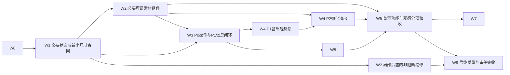

# 大丑牌完整策划与开发交付计划

当前 PC 商店区域改进入口：[单一布局合同与高度例外](PC_SHOP_REGION_CONTRACT.md)，输入 main `51c356a187aff776dfa81eed826df8e032d848d6`；未代签用户观感。
## 当前合同

本文件是当前策划、依赖、决策和交付口径的唯一入口。plan.json保留工作包状态与历史证据；CHARACTER_PLAY_PLAN、WORK_PACKAGES和开发交接保留原合同与历史，不再各自维护另一份“当前计划”。

- **规则与证据资料基线：** 14a9a747fa42764ab8000b6f71382c7bd6bec8ac。执行时读取当前main并记录任务输入SHA。具体文档发布包的expected_main仅约束该次写入，不作为永久开工条件。
- **本次范围：** 整合完整策划、设计备选、条件式账本和开发执行合同。只改六个约定文档；不改已发布代码、数值、内容身份、美术、依赖锁文件或CI。
- **已决玩法：** 六角色均可经营两对、三条、葫芦、顺子、同花五种主线；对子只作早期过渡，高牌只作保底。角色差异来自成型、成长、运营、风险与兑现时点，不是指定牌型职业。
- **已决界面：** 全游戏成熟手绘，人物差异可信；普通九牌状态竖屏同页、商店三货同屏、独立出牌区、清楚文字；点数/花色整理回空选；AI切内部最高候选但不显示预测分，只由玩家出牌或弃牌；音乐30、音效80；不出现一帧占位色块。
- **已发布底座：** 72张大丑牌、八章、39工具、12物品；共同四卡与成组四卡已接入六角色正常新局，仅阿默助攻。技术通过与整体体验、审美、目标设备和正式平衡分别验收。
- **当前设计建议：** 先稳定首章全流程与共同成长入口；优先验证可持续成长和存花取舍，改牌重触作为后期放大选项。先检查现有a06等机制的获取、替代与实际成长机会，不预设必须新增一套成长系统。具体备选及选择门槛见下文设计决策记录。
- **状态：** P08仍in_progress；A03、C04、V01、B00、B01、L及resumeContract按原状态和门槛保持。自然亿级、完整后期、全部六角色平衡、整体审美、真实GPU及听感没有因本文件而通过。
- **执行顺序：** 当前PC共享布局修复与双端验收有界收尾 → 按W0/W1冻结同版首章真实输入与布局，复用已有素材及W2必要共享组件 → W3交互/规则/收益去向和工具使用闭环，W4普通短反馈承接真实事件 → W5共同构筑、经济取舍与自然路径证据 → 受控W4关键高光及W6首章品质验收 → 对应W7、W8与W9。最近新增效果反馈归属W3/W4，不替换W0–W9完整主线；强化演出不插队，非阻断精修可局部后置，不延迟已准备素材的必要映射与复用。W8现有八章通路可在W5后开始，受角色改动的终验等待对应W7。

**执行约束（2026-10-07用户更新）：** 本周游戏开发单线串行，使用6.1、默认Medium；超出Medium须先说明具体理由，不创建并发工作者、不大规模并发。独立其他业务允许另开会话，不改变游戏计划。当前PC共享布局修复与实机验收优先，保留必要事件/布局依赖和原质量门槛；W2非阻断精修不再卡住W3及基础反馈。历史状态按原SHA保留，不冒称已恢复、已上线或已验收；云端软件浏览器结果不能代替用户PC实机验收。

**阅读顺序：** 当前合同与需求索引 → 1至13节产品规格与证据 → 14至19节开发计划 → 设计决策记录 → 三份条件账本 → 逐任务执行卡 → 72卡分流与固定版本来源。后续选择会改变对应章节时，必须同步需求、依赖、验收和成本，不能只在聊天中口头改计划。

**术语：** IMPLEMENTED表示已核实现；PROPOSED表示尚待选择的设计候选；RECOMMENDED表示当前设计建议，不表示已实现或用户体验已获批准；NOT_RUN与NOT_OBSERVED保持各自原义。文档中的数学算例和条件账本不是自然局、模拟胜率或真机验收。

---

## 需求索引

| ID | 已知要求 | 类型 |
| --- | --- | --- |
| U01 | 成熟手绘覆盖整个游戏，包括按钮、面板、弹窗和全状态，不仅人物插画 | 用户要求 |
| U02 | 六角色有可信的年龄、脸型、体态和职业差异，不能同脸或无理由全部重画 | 用户要求 |
| U03 | 竖屏普通九张手牌同页可见，商店三件商品同屏比较，独立出牌区，字清楚 | 用户要求 |
| U04 | 点数与花色整理清楚；整理回到空选状态，清掉旧顾问选择和撤销 | 已知最新交互合同 |
| U05 | AI切第一候选按内部最高分口径选择；界面不显示预测分；只选牌，出牌与弃牌由玩家决定 | 用户要求 |
| U06 | 明显的规则入口；条件、效果、对象、时长、次数、进度和具体牌例写清楚 | 用户要求 |
| U07 | 大分可有全画面冲击，不以火焰为必须方案；不能出现一帧占位色块 | 用户要求 |
| U08 | 默认音乐30、音效80，并实际听验 | 用户要求 |
| U09 | 六人都能玩顺子、同花、两对、三条、葫芦；对子过渡，高牌兜底；角色不锁定牌型职业 | 用户要求 |
| U10 | 新手学会组合，熟手靠有意义的成长和连锁冲击百万、亿与科学计数法 | 用户要求 |
| U11 | 保留可用资产与已接受工程；不靠内容数量或测试数量冒充质量 | 用户要求及执行约束 |
| U12 | 先形成满意的首章品质切片，再扩五角色能力与完整后期；既有八章通路检查可按依赖提前核查，本周仍串行 | 当前设计建议，仍须分阶段验收 |
| U13 | 临时反馈先分流，不自动打断关键路径；重大阻塞及时报告，常规进度每小时汇总 | 已知任务沟通要求 |
| U14 | 不编造配额消耗、token归因或完成百分比；每包有负责人、验收与止损 | 用户反馈导出的执行要求 |

## 1 首章品质切片

### 1.1 交付目标

先把第一章做成玩家愿意继续玩的完整体验。现有代码、卡牌和素材是可复用底座；验收依据是玩家实际看见、操作、理解和感受到的结果。

首章切片沿用当前正常入口、真实货架、真实抽牌和保存规则，不另建一套只会演示的游戏。正常选角、开局商店、首场、局间商店、首章压轴、结算和继续应形成连续体验。

| 阶段 | 玩家行为 | 这一步必须传达的结果 |
| --- | --- | --- |
| 首页与选角 | 区分继续与新局，选角色，再确认 | 当前局状态真实；角色改变决策方式，不锁定可用牌型 |
| 开局商店 | 同时比较三货、余额和已有构筑 | 何时生效、买得起与否、占用什么资源和机会 |
| 首场 | 看目标与公开限制，整理当前手牌；九牌容量状态另验；自选或AI切后决定出或弃 | 当前牌型、有效计分牌和留牌理由清楚 |
| 第一条连锁 | 跟随实际来源与数字变化 | 加成、相乘、再次计分有因果，组合由玩家安排 |
| 补件与成长 | 买牌、升级、改牌或保留金币 | 本手得到什么，什么留到下一手，缺件如何替代 |
| 首章压轴 | 提前读规则，调整原打法 | 哪些牌或能力被影响及原因明确 |
| 章末与恢复 | 看实际结果，继续或退出后恢复 | 保存成功；继续、同种子重试与新局区别清楚 |

### 1.2 首页与选角合同

- 首页区分继续、新局和设置；继续展示当前局真实状态。读档失败提供可理解的恢复入口。
- 六角色先选中再确认，卡面单击不直接开局；能力、代价和限制可查。
- 返回不误开局、不改变随机或丢失未提交草稿；确认后进入既有正常流程。
- 不在首手前增加强制长教程或世界观动画。完整教程属于后续C04的独立范围。

### 1.3 范围

优先以已上线阿默完成端到端首验，公共成牌与商店不能做角色特供。六角色选角完整保留。纳入第一章内的完整界面、必要规则、三条共同路线早期证据、代表性连锁、胜败、设置和恢复。

既有72张大丑牌、39种工具、12件物品和八章内容保留。先审切片中真实出现及代表性复杂内容，不追加卡量证明进度。

首章通过不等于六角色平衡、八章全流程、无尽可达、所有美术终稿、多人对标或全部设备通过。C04原暂停项目仍按其恢复条件安排；必要的规则解释和入口发现性不需要等待完整图鉴、历史系统重启。

## 2 牌桌信息与竖屏布局

手牌、独立出牌区和主动作优先。头像、背景和装饰不得挤占它们。

| 区域 | 常驻信息 | 交互与视觉合同 |
| --- | --- | --- |
| 场次区 | 当前场、目标、累计分、出牌与弃牌余次、金币、限制入口 | 累计进度与本手结果分开；重要状态不藏进长弹窗 |
| 构筑区 | 大丑牌、槽位顺序、名称、公开状态 | 小图可辨身份；详情与调序边界清楚；稀有度不只靠颜色 |
| 独立出牌区 | 当前主手、实际判型、有效核心与附带牌 | 与手牌源区分开；选入和取消清楚；不遮剩余牌角标 |
| 手牌区 | 普通九牌同页，点数花色、选中和失效状态 | 抬起不遮下一张；增强、版次和纹理不盖角标 |
| 动作区 | 点数、花色、AI切、弃牌、出牌、真实余次 | 出牌是主操作；弃牌独立；整理与耗资源动作分组 |
| 常用入口 | 规则、工具包、牌组查看、设置 | 明显可找，可关闭，返回不丢草稿，不依赖鼠标悬停 |

**尺寸底线：** 高频正文至少14px、主要数值至少22px；主操作至少48×48 CSS px，次操作至少44×44 CSS px。既有更大主操作不倒退，不能把所有按钮简化成44px。目标设备实际触控与清晰度仍需验收。

普通九牌必须一页可见。扩容量遵守已实现的窄屏容量方案，不为了十四牌极端情形牺牲普通局。已有有界证据是320宽十四牌分页、390宽十四牌两行，不表示所有小屏十四牌都单页。

在同一真实画面检查未选、选满、失效牌、长名称、工具包有货、角色可用与禁用。命中区不随抖动、卡牌抬起或缩放漂移；手绘边缘可以自然，文字对齐和操作反馈必须稳定。

## 3 选牌 整理与AI切

### 3.1 草稿与提交

轻点选择，再点取消。选牌、看详情、关闭规则和取消只改草稿，不消耗次数、金币或随机。出牌与弃牌各自校验所选牌、资源、阶段及保存状态。重复点击只能形成一次合法事务。

点数或花色整理清空当前手选、直选、顾问选择和旧撤销，再按真实规则整理；不能残留旧候选或消耗出弃次数。

### 3.2 内部最高候选

先按既定资格生成合法候选：有可成牌候选时，高牌不进入首选集合；再对该集合使用当前公开状态的内部计分由高到低排序。首个取最高分，并列使用稳定实例ID顺序。对子可作过渡，两对、三条、顺子、同花和葫芦是主要追逐。

不窥视未来牌，不推进规则随机数。含随机结果的卡需要规则负责人锁定可复现的公开信息估值口径，并明确其不是保证发生的随机结果。固定牌型目录逆序不能冒称得分排序。这属于技术合同审查，不重新向用户索取已明确功能的逐项批准。

**对外只改变选择：**

- 不显示预计本手总分、预演来源、累计H×M或未来火档。
- 不自动出牌、弃牌或提交角色动作。
- 玩家改选后以玩家草稿为准；迟到计算不能覆盖新选择。
- 继续切换必须基于同一有效快照；状态、规则身份、槽位顺序或能力进度变化后更新候选。

### 3.3 状态机与验收

可输入 → 草稿选择 → 提交校验 → 保存中 → 真实结算 → 可输入或场次结束。

按钮状态必须与领域允许的命令一致。保存失败不播放成功；保存重试不重新算分或抽随机。切后台、离场、快进和恢复不能残留旧回调。

核对手选→整理→AI切→手改→取消；再核并列、失效核心、增强、版次、角色状态和大丑牌顺序。构造输入用于排序边界，自然局用于操作体验，两类证据不能互相冒充。

## 4 规则入口与卡牌说明

玩家不应先读完整策划才能玩。常驻规则入口、牌旁短提示、完整详情和实际结算解释共用同一内容身份的规则事实。

每张卡必须回答：

1. **条件：** 何时触发，针对主手、有效计分牌、持牌、买卖还是过关。
2. **效果：** 加热度、加倍率、乘倍率、指定牌再次计分、资源或成长变化。
3. **时点：** 本手、成功过关、下一手或之后持续；不为文案顺畅改执行时钟。
4. **持续与次数：** 每手/每场限制、封顶、重置、出售或失败后的处理。
5. **当前状态：** 已存成长、已用次数和不可用原因；未触发不得写“已获得”。
6. **牌例：** 一条成立和一条不成立例子，不带虚构分数或未上线机制。

可用牌例：9♠、9♥、K♣、K♦是两对；7♠、7♥、7♣是三条；8♠、8♥、8♣、J♦、J♣是葫芦。顺子举5、6、7、8、9，同花举同花色五张。四牌例外只在实际持有对应效果时成立；普通顺子、普通同花与同花顺的要求分清。

“倍率增加”“倍率相乘”和“这张牌再计分一次”必须分开；再次计分不是整手大丑牌链重来。“整手”不能代替真实条件和对象。

帮助分层：牌桌一句必要提示 → 当前卡完整条件、状态与例子 → 牌型和当局限制。打开帮助不清草稿、不推进资源，关闭回原焦点。旧局显示旧身份规则，不贴新局说明。

理解验收请新玩家复述：为何这一手有效、哪张没有计分、成长何时留下、缺关键卡怎么办。回答不了，先修信息和规则表达，不单纯堆教程文字。全部72卡工作流及逐卡分流见附录。

## 5 商店 工具与局间流程

三件商品的图、名称、关键条件、价格和可买状态同时可见。复杂规则放详情，但短文案不漏决定性条件。余额、已持构筑与顺序要在比较时可读。

| 场景 | 操作合同 | 失败和取消 |
| --- | --- | --- |
| 购买 | 选中看信息，明确购买才支付；价格来自当局 | 钱不足、满槽、阶段限制分别说明；取消不扣金不换货 |
| 出售与调序 | 出售目标和结果明确，调序有稳定落点，结算按新顺序 | 拖动不误卖，取消回原状态，恢复保真实顺序 |
| 刷新 | 成本和货架状态公开，一笔事务一次换货 | 重复点击和恢复不能免费刷货；失败不播放成功 |
| 工具包 | 商店和牌桌入口一致，消耗工具与局内物品分清 | 商店专用工具在牌桌说明原因，关闭不误使用 |
| 工具使用 | 选合法目标，展示将改哪张牌的何种属性，确认后消耗 | 非法目标拒绝，取消保草稿，不留半次改牌 |
| 选场与Boss | 入场前看目标、奖励与公开限制，压轴规则可提前查 | 不投入资源后才揭示决定性克制；返回不重抽奖励 |

过关展示已经保存的结果、真实奖励来源和成长去向，不重复发奖。失败展示差额、最后一手、剩余资源和实际限制，不编造“本来必胜”。继续、重试和新局的去向与规则身份清楚。

牌桌、商店、设置、规则、胜败和错误页共用字体、材质和按钮语言。载入、缺图、网络慢、声音未解锁都有完整状态；禁止闪回纯色占位矩形。允许保留已认可缩略图并提供重试。

设置默认音乐30、音效80；滑杆、静音、恢复与实际声音一致，不能只改数值显示。

## 6 成熟手绘的统一规范

全游戏手绘覆盖所有可见构件。成熟感来自可信人物、明确层级、节制纸墨细节和组件一致性。现有资源先保留，只对指出具体缺陷的部分返工。

| 维度 | 执行要求 | 拒收表现 |
| --- | --- | --- |
| 人物 | 年龄、性别、脸型、体态、职业和道具差异；面部、手部、动作可信 | 六张同脸、全部少女化、错误肢体、刻意画丑 |
| 墨线纸色 | 沿既定纸白、青蓝、朱红、墨色关系；有手绘变化但轮廓和留白统一 | 伪金属渐变、无关写实3D、脏纹理遮字 |
| 按钮面板 | 正常、按下、禁用、选中、焦点、加载完整；统一纸边和墨线 | 平涂色块顶替成品，默认控件夹杂，仅首页精修 |
| 普通牌 | 点数花色清楚独立绘制；牌边、选中、增强与版次统一 | 角标嵌进生成图而糊字、纹理遮挡、只凭颜色区分 |
| 大丑牌工具 | 实际小尺寸能辨主体、名称和道具；详情完整等比展示 | 拉伸裁脸、图清字糊、把规则画进不可读图片 |
| 全界面 | 选角、商店、牌桌、帮助、设置、胜败与错误态共用规范 | 一屏成熟下一屏拼贴，一帧露旧样式或占位 |

沿已记录角色方向：阿默是安静自信的年轻女默剧师；骰爷是结实市井男赌客；老幻保留年长幻术师的灵动；二响是有笑纹的成熟女说书人；阿燥年轻、轻快、有动势；谢幕人从容收势，保留成熟女性年龄感。

手绘纹理属于画面，文字和命中区属于信息系统。重要中文、数字、花色、价格和次数保持锐利。按钮边缘可自然，排版、按压和触点不能随机。

## 7 资产复用与美术样板验收

先将已有资源放进真实牌桌与商店尺寸评审，指出具体缺陷再返工。既有角色、功能牌、J/Q/K、工具与物品先核稳定ID、当前映射及实际尺寸用途；素材接入/复用、共用组件与具体精修分开。影响辨认、角标可读或实际操作的缺陷前置修，只有具体非阻断精修可局部后置；不要求整批重画才修体验，也不把全部美术或已准备素材挪到最后。文件格式、数量和加载通过不能替代整屏审美。

已准备素材及下一批分流入口：[2026-10-07素材对账](ASSET_RECONCILIATION_2026-10-07.md)。清单与静态映射核对不等于像素、加载或用户满意验收。

资产分四类：

- **直接保留：** 风格、解剖、尺寸和清晰度已合格，记录稳定ID与用途。
- **局部加工：** 主体合格，仅裁切、边缘、背景、颜色或清晰度有问题；保原图与实际尺寸对照。
- **重新制作：** 人体、构图或语义根本错误且难以修补；只替换对应资产，先明确缺陷。
- **保源不使用：** 旧样式、未批准候选、无明确价值的3D源归档，不为沉没成本接入。

第一套样板应有真实竖屏牌桌、三货商店、组件全状态、规则/设置/失败页、现有六角色反差对照，以及一次真实连锁关键帧和事件时间线。不能删除真实信息来把样板做成漂亮海报。

签收问题：人物能否区分，脸手是否可信，九牌角标是否全读，主动作能否先看到，三货能否比较，按钮面板是否统一，结算是否仍可读，是否出现一帧色块。逐项记录通过、需改或未测，绑定同一候选版本。

原图、缩略图、详情图和运行时ID映射清楚；按显示尺寸导出，高清按需；失败回退不改变卡框。记录真实来源和许可，只把实际采用的资源或组件记作采用，参考不算调用。

## 8 真实连锁与音画反馈

演出沿已成功保存的真实事件：有效普通牌 → 对应能力与大丑牌来源 → 加成/相乘/指定牌再计分 → 最终结果收束。无事件的来源不亮、不响、不跳。

| 层次 | 玩家感受 | 实现边界 |
| --- | --- | --- |
| 选与取消 | 立即知道选中哪张，位置稳定 | 轻反馈，不提前表演得分 |
| 普通计分 | 有效牌与实际数值联系清楚 | 节奏利落，附带和失效牌不假计分 |
| 加成与相乘 | 层次提升，来源可认 | 不是同一段亮光覆盖所有语义 |
| 再次计分 | 明确是某张牌的相关事件再发生 | 反馈附着原牌，不整手重播 |
| 大分兑现 | 全画面冲击、停顿和回落 | 可用纸墨、舞台或全屏构图；非火焰方案需真实小样 |
| 过关奖励 | 分数与资源真实落袋 | 保存成功后演出，快进与恢复不重奖 |

硬底线：音乐30、音效80实听；静音、后台、首次解锁和恢复有效；不叠多份音乐；任何一帧不出现占位色块；全屏效果不遮分数、来源或操作；低动态和快进不改结果。

分开签收工程事件一致性、审美节奏、真机GPU/触控/发热、实际听感。软件Canvas截图和CI不能替代后三项。

## 9 六角色共同底座与差异

六人都能玩核心成牌。角色区别来自成型、成长、资源经营、风险与爆发时点，不是固定牌型职业。以下保留原已记录方向，后续新研究可以比较方案，但不能把候选写作已上线。

| 角色 | 既定战术方向 | 基线事实与待锁定合同 |
| --- | --- | --- |
| 阿默 | 主手、同点副组与持牌取舍，一次有代价助攻 | 正常入口与助攻已上线；补自然取舍、发现性与整体体验证据，不退回高牌强化 |
| 二响 | 指定有效核心再次计分，以连续同点经营 | 回声原型未确认远端交付，不计入14a9上线能力；目标资格、断链、次数和保存合同需核当前成果 |
| 阿燥 | 连续不同合格成牌蓄势，玩家主动释放 | 候选；重复、低阶手、释放手是否蓄势和封禁边界由负责人锁定 |
| 谢幕人 | 早期留钱，后期花真实金币兑现 | 燃金、限额和重置为候选；支付与出牌原子，持币效果读扣后余金 |
| 骰爷 | 弃前押尚不可达成牌，下一手兑现风险 | 不能凑好后再押，不能取消免费退风险；后续弃牌、失败代价和时钟先定 |
| 老幻 | 有限多看补牌候选，选择应补数量服务成型 | 先锁补牌中间态、取消恢复与余牌去向，再接界面；不能取消反复重抽 |

六角色新局共用同一已批准大丑牌底座，再叠能力。旧局按原身份继续。主手、有效核心、助攻消耗与持牌分账；助攻不能同时领持牌收益或被误记为弃牌。

角色进度、代价、可用性和重置公开可读。原计划中的占位倍率、档位和次数不自动成为最终参数。日常技术合同由负责人决策并独立复核，不要求用户逐角色批准已明确方向。

当前设计建议是共同构筑和首章品质先稳，再逐个推进五角色；复杂补牌中间态后置。后续方案与取舍见设计决策记录，未通过选择门槛的候选不能直接实施。

## 10 计分成长与学习路径

保持唯一判型与计分来源。当前等级、有效核心、加成顺序和结果由权威规则读取，UI、AI与详情不另造公式。既有精确大数、最终取整、有限重触发与事件护栏保留。

学习阶梯：

1. 成牌：学两对、三条、顺子、同花、葫芦，理解哪些牌该留。
2. 补件：买即时收益、成型工具、升级或留金币各有目的。
3. 成长：本手结果、已存成长、何时生效和何时重置分清。
4. 顺序：增加倍率、相乘和指定牌再算不同，能解释调序。
5. 经营：普通与特别卡起步，稀有卡放大；转型不能无故断链。
6. 大数：百万、亿与科学计数法来自自然可形成且有代价的长期构筑。

三条共同路线都要有入口、过渡、成长、兑现、缺件替代：

- 成组：对子过渡到两对或三条，再到葫芦。
- 顺子：留弃牌与改点补缺，升级并围绕关键牌兑现。
- 同花：花色骨架、染色与升级、有效计分牌收益。

共同四卡a06/f10/d12/e04及成组四卡b03/b06/b08/b10已经进入14a9相关正常新局，不能再笼统标为未实现。b10有自然购买、两对、三条、葫芦的有界证据，最后一手1470；不代表全部共同路线完成。

a06已有跨场乘法成长；当前主要未证实项是获取与替代、有效成长机会及完整战斗路径。任何长期引擎、角色参数或稀有价值修订仍需条件、成本、时点、重置、上限及自然证据。不能默认无限乘法、放开递归或全局加倍。新研究提出新机制时必须标候选，并说明保留既有实现还是新身份变更。

## 11 商店经济与大数可达性

经济要看真实局里看得到、买得起、用得上，并有不买的理由。理想库存不能证明可达；策略漏买不能直接归咎货池。

| 检查对象 | 必记内容 | 判定 |
| --- | --- | --- |
| 早期入口 | 金币、实际三货、价格、选择理由与下一场结果 | 普通/特别能起步，不以多稀有齐套为前提 |
| 转型 | 原牌型、已存成长、升级改牌成本、转后实际读取 | 成组升级及转顺同均按真实规则解释 |
| 缺件 | 缺什么、可见替代、代价、停滞原因 | 有现实合法替代，不暗送，也不要求每局必胜 |
| 留钱消费 | 现金、利息基数、支出、槽位和替换损失 | 支付后不能继续享原本金收益 |
| 稀有价值 | 同阶段同槽位替代、条件成本、有效窗口 | 价值可解释，不能只靠颜色和价格 |
| 无尽 | 各章触发、支出、损毁、补件和续航 | 单手峰值与可持续经营分开 |

每线先做有界自然记录，与基线或缺件情形配对。固定版本、角色、难度和初始条件，不刷种子挑赢家，不导入成熟库存冒充自然形成。失败保留；小样本用于定位，不输出全局胜率或六角平衡结论。

普通八章承担学习与经营，不强迫新手打百万或亿。无尽承担长期放大，但需查后续目标、重复收益、断供和恢复。科学显示存在不等于自然可达。

原QUALITY中的正式留出平衡、多人对标和长局性能保留。首章体验尚未通过时不启动重型模拟替代整改；恢复执行前由统筹确认版本、预算、范围和停止条件。

## 12 已有实现与证据边界

本节是14a9资料基线的状态摘要，不是本轮重新运行的测试。

| 项目 | 已知结果 | 未证明或仍需复核 |
| --- | --- | --- |
| 内容与资源 | 72大丑牌、八章；39工具、12物品接入；goods的102 WebP是变体文件计数 | 整体成熟手绘、六人全部解剖与全状态审美；102文件不等于102件内容 |
| 阿默 | 正常入口、主副组与保存合同已上线 | 完整满意度、六角平衡、设备与听感 |
| 共同与成组八卡 | 正常新局接入；有限工程与原生检查通过 | 所有路线好学、可得、持续；其余五新版能力完成 |
| b10自然路线 | 自然购买；两对402、三条634、葫芦1470；成长保存50 | b03/b06自然可负担获得与成长转顺同为NOT_OBSERVED |
| 大数 | 合法构造百万和亿级单手；精确存储与科学显示已有 | 自然到亿、持续多章与复玩 |
| 历史首Boss | 固定运行时7b787773完成首Boss及恢复 | 当前14a9完整八章、第二章及后续；旧专项不能相加填补 |
| 新版二响 | 有原型在制线索 | 远端交付未确认；不计入上线能力或硬依赖 |
| 正式质量 | 有CI与工程专项 | A03整体批准、V01多人、B00平衡、B01长局设备及L签收未由此通过 |

每项状态分六栏：实现、技术验证、玩家理解、审美批准、目标设备、发布身份。任何一栏通过不能推导其他栏。

历史专项保留实际源码SHA，例如PR27证据的测试来源与14a9资料所在提交不能混成一次新测试。采用时查看来源范围、受控/自然区分及原NOT_RUN，不仅看PASS字样。

## 13 工程约束与恢复安全

| 约束 | 执行要求 | 证明 |
| --- | --- | --- |
| 内容身份 | 旧局冻结，新规则用明确身份，混配拒绝 | 旧档继续/导入/重试一致，新局确用新规则 |
| 唯一事实 | UI和助手读共同规则事实，结果来自真实提交 | 同命令可复现，整理不变随机 |
| 原子资源 | 出牌、代价、金币、成长是合法事务 | 失败不半扣，重试不双扣，保存后演出 |
| 中间态 | 角色、工具、补牌候选有取消恢复合同 | 不重抽套利，不软锁，不无法退出 |
| 演出解耦 | 快进静音低动态只改表现，旧回调不作用新局 | 中断与正常播放结果一致，不重奖 |
| 输入视口 | 鼠标触摸、换向、安全区共享稳定命中 | 多指取消、拖点区分、换向不重置 |
| 资源性能 | 轻量缩略和按需高清，不以糊字换速度 | 实际请求、解码与设备证据 |

日常体验整改优先修具体界面和缺口，不每次重写规则与存档。底层合同确有问题时，按影响范围修并保旧档。

**状态治理只做小前置：** 当前main、候选、工作包、阻塞、最新验收和下一依赖只维护一份摘要；历史按SHA归档，不删失败。plan、交接和README不各写相互矛盾的“当前”。

已知历史冲突包括plan中的PR20调度、角色计划顶部PR27与下方“未实现”、旧27/39及最后12图待发布与后来39/39、单图铜钱事实并存。只纠正当前入口，不据旧文字反推代码未做。

## 14 工作包与依赖关系

工作包落实到现有P08、A03、V01、B00、B01、C04与L体系，不建立平行主线。每包一个实现负责人、一个独立验收者，开工前填具体人选、范围、输入、预算、输出与停止条件。

下文P0/P1/P2只描述操作与效果反馈的局部层次，不是完整项目的新总排序；W1简报中的P1–P4另指四项比较任务。玩家自行做牌、买成长、弃牌找组合、成长转型、存花取舍、缺件替代及自然高分仍由W3/W5承接；六角色核心牌型共用、W7逐角、W8八章/无尽/C04和W9质量门槛均保留。

| 包 | 交付物 | 前置 |
| --- | --- | --- |
| W0 基线统一 | 当前状态一页与证据索引，历史明确归档 | 统筹锁定范围和基线 |
| W1 首章样板 | 真实牌桌、商店、关键状态规格与缺陷对照 | W0 |
| W2 手绘组件与修图 | 已有素材映射/复用、必要手绘共用组件与有限修图；具体非阻断精修可局部后置 | W1对应状态验证；与W3冻结组件合同，不等整批重画 |
| W3 交互信息闭环 | P0操作障碍；P1全类效果事实、收益去向与使用闭环 | W1必要状态验证、现有可读手绘素材、最小组件尺寸合同；不等W2整批完成 |
| W4 连锁音画 | P1基础可理解轻反馈；P2关键特写/连锁/大分演出 | 基础：W3对应事实与真实事件；强化：基础反馈、稳定布局与必要组件/代表trace；不等W2全量精修 |
| W5 共同构筑证据 | 三线起步、成长转型、缺件替代、价值问题 | W3及共同八卡基线 |
| W6 首章整体验收 | 同版首章功能/可读性、目标设备、用户关键节点；审美分项留证 | W3/W4/W5对应功能和首章必要可读素材；不以全部素材重画或W2全量精修为前置 |
| W7 逐角色能力 | 五角色逐个有界候选、保存与自然玩法；阿默补证据 | W6及对应规则合同 |
| W8 八章与完整功能 | 八章、无尽、可达性；恢复后补C04模式/教程/图鉴/历史 | W5可开始；受角色影响终验等对应W7 |
| W9 正式质量交付 | 人测、留出平衡、长局设备、冻结、回退、签收 | 入口W6 W8与相关W7；内部逐级满足原质量门槛 |

关键依赖：

- 首章依赖：W0 → W1 → W2必要组件/素材与W3交互 → W4真实音画与W5共同构筑 → W6；具体非阻断精修不作为整批开工阻塞。单线实际排程先基础交互/短反馈与共同玩法证据，再受控关键演出；W5不等待强化特效，也不是全部基础反馈的硬前置。
- W2的已有素材复用与必要共享组件持续进入首章W3/W4/W6；具体非阻断精修可局部后置，不改变U01全游戏成熟手绘范围。W6仍需首章功能及关键观感分项签收，总体美术未通过保持待最终验收。
- W6解锁W7。本周游戏全部单线串行，同一UI只有一个写入窗口；结构上可独立的工作不表示授权创建并发工作者。

依赖图（W4基础/强化是同一工作包的阶段，不新增平行主线）：

- W8的现有八章通路与共同构筑核查在W5后即可开始；不能为等待全部五角而拖延现有流程缺口。
- 受角色修改影响的最终流程验收等待对应W7，最终共用版本汇合到W9。
- C04暂停范围在统筹恢复后补完；完整1.0交付不能默默省略。

共通完成条件：结果可看可操作，失败用例保留并复测，相关回归通过，资产与旧档无意外变化，证据绑定确切版本，独立验收者实际检查。合并、测试数或清空任务列表不单独构成完成。

## 15 首章工作包执行合同

### W0 基线统一

- 负责人：集成；复核：项目验收。
- 输入：14a9、已核发布记录、角色计划与专项证据。
- 操作：写唯一当前摘要，核共同卡和资产覆盖，历史加时间/范围标识。
- 输出：当前版本、下一包、未验项目和证据索引。
- 退出：新接手者能回答当前是什么、下一步做什么、不能宣称什么；不重跑无关历史矩阵。

### W1 首章体验样板

当前必要状态：[2026-10-07同版九牌/完整商店/管理输入](evidence/w1-inputs-2026-10-07/INPUTS.md)及[剩余范围](evidence/w1-inputs-2026-10-07/REVIEW.md)。PC商店窄列属于首章全流程验收遗漏，串行有界修正；战斗HUD通过不代表PC整体已修好。

- 负责人：体验设计；复核：用户关键审美或授权验收者。
- 输入：当前画面、第1至8节、已有资产。
- 操作：挑真实关键状态，整屏对照，写具体保留/修正项。
- 输出：牌桌、商店、说明、连锁有限样板。
- 退出：既定方向的样板执行质量获认可，余项能落具体元素。不量产新图；先用既定方向内的执行方案对照收敛，不把研究建议冒充玩家认可。

### W2 手绘组件与资产修正

- 负责人：美术表现；复核：独立视觉。
- 先核并复用已准备角色/功能牌/JQK/工具物品的当前映射，提供首章必要共用组件、稳定尺寸/命中和加载回退；影响辨认操作的缺陷前置。仅具体非阻断精修局部后置，不以整批重画阻塞W3/W4基础反馈，不推迟已做素材的必要复用。
- 输出：可复用组件及有限资产修正。
- 退出：整屏统一、文字清楚、无一帧色块，未见缺陷的资产保留。

### W3 交互与信息闭环

有限入口：[W3最小开工卡](W3_MINIMAL_START_CARD.md)。 [首120秒来源→收益→下一步整包候选](evidence/w3-w4-experience-2026-10-07/README.md)接通共用条件、轻来源反馈与可用入口，软件有界通过；玩家理解/留存、真机及整体W3/W4仍待验。 [三货共用真实支付与优惠状态](evidence/w3-purchase-discount-2026-10-07/README.md)补原价/实付/唯一总省额，保留名义来源与实际分摊未知；软件有界通过，真实经营理解和实机待验。 [换一身真实赠品与商店使用样板](evidence/w3-stage-gift-2026-10-07/README.md)消费已保存事件，区分入包与满包替代；软件有界通过，真实理解/实机及全类反馈仍待验。 [工具目标整理与既有素材复用](evidence/w3-tool-targets-2026-10-07/README.md)推进同点/同花改牌选择，软件有界通过，玩家经营理解与实机待验。 [常规路径成长反馈软件证据](evidence/w3-growth-discovery-2026-10-07/README.md)仅补已保存成长/下手时点的可见提示，真实新人理解仍待验，不代签完整W3。 [成长因果小批软件证据](evidence/w3-growth-causality-2026-10-07/README.md)接续已有自然存档核跨场实际读取与重入，玩家理解和自然迁移仍待验收，原W3/W5顺序保持。 [购物去向小批软件证据](evidence/w3-purchase-destination-2026-10-07/README.md)补三类实际购入与现有下一步入口，待独立复核/共同验收，完整W3仍按原计划。 本批[安全商店管理软件证据](evidence/w3-shop-management-2026-10-07/README.md)只覆盖窄屏误触、短横管理和安全弹窗，待独立复核与玩家验收，不代签W3整体闭环。公开条件提示区分当前手牌可组成、当前选择满足、为下一手准备、封禁/未满足与随机未确定；不预演总分、不自动操作。c11首手普通顺子只为下一手普通同花准备，紧邻顺/同交替才×1.75，首手/同型/同花顺不触发。

- 负责人：唯一UI；复核：操作及规则。
- P0先九牌与独立出牌区、PC/手机操作障碍；P1补整理AI、规则、商店工具及全类效果来源→条件→真实收益→去向→下一步。用现有可读手绘素材和最小组件合同启动，不等W2整批精修；按正常流程关误触和理解缺口。
- 输出：首章实际可操作路径、收益可查与使用闭环；事实与W4基础反馈共用真实事件。
- 退出：第2至5节正反例通过；AI不自动出弃；条件价格不裁切；不靠领域重写解决排版。

### W4 连锁音画

- 负责人：表现音频；复核：事件一致性、听感和视觉。
- P1基础阶段先真实来源、条件、实际收益与去向的短句/数值/轻反馈；P2强化阶段再关键特写、连锁节奏、声音、大分与低动态。前者依赖W3事实和已保存事件，后者保留稳定布局、必要组件与代表trace依赖；均不等W2全量精修。
- 输出：全类基础反馈先闭环，再小收益、加/乘、重触和大连锁受控强化样板。
- 退出：真假事件一致、取消恢复安全、30/80实际听验；真机未测保留NOT_RUN。

### W5 共用构筑与自然证据

[培养目标→工具→现金取舍→下场收益的连贯软件候选](evidence/w5-build-journey-2026-10-07/README.md)复用已有事实/确认页/手绘来源，一条正常获取路线与受控对照分开留证。三线自然可达、玩家理解及W6设备/观感待验；原门槛不变。

- 负责人：玩法规则；复核：独立自然路线。
- 输入：共同八卡及已做72卡审计。
- 优先补自然可负担获取、成组升级、成长转顺同、缺件替代；先复用成果，修真实断点。
- 输出：三线有界路线、缺口和需决策参数。
- 退出：非理想库存也有可解释经营；不把小样本称整体平衡。新机制先标候选再审。

## 16 扩展包与阶段放行

### W6 首章整体验收

同一候选走正常入口到首章结束，包含商店、弃牌、帮助、连锁、失败、恢复。以前述功能与首章必要可读素材为输入，不以全部素材重画或W2非阻断精修完工为前置。先关阻断、理解与使用闭环，再签关键观感；总体美术质量仍需最后分项验收，不能宣称完成。界面、操作、理解、连锁、保存和实际设备分别有结论。用户不接受核心体验时，留在首章修，不靠新角色分散问题。

### W7 逐角色能力

每次一个角色能力负责人，规则与玩家体验独立复核。先锁资格、代价、时点、重置、取消、封禁，再领域与保存，再公共UI，最后自然体验。二响先核在制成果再复用。老幻等复杂中间态有完整恢复合同后实施。原旧身份和共同牌型底座保持。

### W8 八章与完整功能

W5后即核现有八章通路、Boss、工具、转型、胜败和无尽衔接。受角色变化的终验等相应W7，不把全部五角完成当早期通路核查前提。记录大数来源、损毁、支出与续航，先定位断供和不可达，再系统调参。

统筹恢复后补C04模式、教程、图鉴、历史和全流程验收。C04完成是完整正式B/L交付的范围要求，恢复时机由统筹排期，不新设用户逐项审批。旧首Boss加新专项不能拼成当前八章通过。

### W9 正式质量与交付

恢复原QUALITY正式人测、留出平衡和长局设备门槛，记录参与者、设备和版本。冻结后完整回归、素材来源核验、构建校验、回退演练，再交仓库与可校验产物。用户自行部署的既定分工保留；开发交付和线上验证分开。

| 门禁 | 放行 | 不通过 |
| --- | --- | --- |
| G0 方向 | W1真实整屏认可，信息未被美术删掉 | 修具体维度，不扩资产 |
| G1 首章 | W6，用户接受观感操作，理解问题留证 | 首章整改，不扩玩法遮盖 |
| G2 玩法 | 六角色有差异、共同成牌，三线缺件和完整流程成立 | 定位角色/经济断点，不乱加倍率 |
| G3 正式候选 | 原人测、平衡、设备、素材和恢复门槛签收 | 保持候选，CI不代签 |
| G4 交付 | 源码、构建、说明、已知限制、回退一致 | 缺项补齐，线上未核单列 |

## 17 验收用例与证据包

验收使用观察与复现，不给“成熟度80分”任意评分。每例记录版本、环境、输入、实际结果、结论、证据。自然、受控合法输入、真人观察分开。

| 验收项 | 通过 | 必要反例 |
| --- | --- | --- |
| 九牌清晰 | 普通竖屏九牌同页，点数花色价格条件可读 | 满选、长名、失效、安全区、换向 |
| 独立出牌区 | 主手与源区清楚，选入取消不挡不丢焦点 | 满选取消、规则返回、多指取消 |
| 整理AI | 清选合同正确，最高口径成立，只由玩家出弃 | 迟到候选、手改、并列、忙状态、预测泄露 |
| 商店三货 | 三货条件价格可比较，买卖调序可预期 | 不足金、满槽、长按、误拖、连点、恢复 |
| 人话规则 | 条件对象效果时长进度例子匹配真实规则 | 零增益、封禁、次数用尽、未读成长却写读取 |
| 连锁 | 来源真、放大可理解、有高潮 | 未触发乱亮、重触整链、遮字、色块 |
| 保存 | 不双扣重奖，旧档原规则 | 中断、支付/保存失败、同候选重试、旧导入 |
| 自然构筑 | 起步成长兑现替代可解释 | 成熟库存、刷种子、未观察到冒充通过 |
| 设备声音 | 实际设备触控GPU长局听感有分项结论 | Canvas、包体积、无声录屏代替真机 |

常规证据只保存够用的变更说明、相关测试摘要、完整关键帧和事件时间线。触控时序、GPU或听感需动态判断时增加实际设备短片。不为数量全库重拍或反复跑无关矩阵。失败按原SHA保留。

分级：丢档、错算、误扣、重复奖、软锁、主操作失灵是阻断；不可读、错误解剖、误导条件、看不懂连锁、色块是当前品质门禁问题；不影响理解操作的小细节可排队，不自动打断关键路径。

## 18 配额止损与变更管理

两轮七天配额后，用户对美术交互约三成预期的评价是主观体验反馈，不能当完成率，更不能用图片、卡数或测试数反算剩余token。

每包开工卡：一句玩家可见目标、允许变化范围、确切基线、输入和样板、一个负责人和一个验收者、要看的场景、最少证据、实际可用预算、探索上限、停止条件与回退点。

实际消耗只记可核平台/账单值；不能按任务归因就标未知。已知工程返工与未知token归因分开，不编造账。

止损：

- 一条首章品质主线，不能靠扩内容掩盖观感与交互未达标。
- 同方法连续失败两次先复盘输入、假设、工具和口径，再改方案，不原样重试。
- 小样早评，再接入精修；只修明确问题，不无理由全库重画。
- 测试按变化风险，保计分存档主路径；跨系统或冻结才跑相应完整门槛。
- 同一UI一个写入负责人；边界独立、输入冻结的任务可并行。
- 新反馈先分当前阻断、当前质量、无关细节或新方向；除明确要求，不自动打断已在关键路径的工作。
- 当前多方向设计已授权，应给有限、可比较的方案与清楚取舍，不把探索变成无边界开题。

每小时报告新增可见成果、核验门槛、阻塞和下一依赖，重大阻塞及时报。排期按依赖，用首个实际工作包校准；人员、设备、审批窗口和配额未知时不承诺精确日历交期。

## 19 待锁定事项与整合起点

日常优先级、技术合同和排期由项目负责人组织决定与独立复核，不新增一轮用户逐包、逐角审批。关键审美、改变原需求的显著取舍和新增费用才需要相应用户决定。

| 事项 | 下一输出 | 影响 |
| --- | --- | --- |
| 首章执行样板 | 真实牌桌商店连锁样板，保留与返工项 | W1 W2 |
| AI最高分 | 第3节候选资格与稳定并列；随机项技术口径 | W3 |
| 大分表现 | 有限非火焰候选的冲击、可读性、收束比较 | W4 |
| 长期成长 | 自然断点、少数引擎候选、条件代价上限 | W5 W8 |
| 五角色 | 每位目标资格代价重置封禁与恢复合同 | W7 |
| 完整范围 | C04恢复排期，正式人测/平衡/设备安排 | W8 W9 |
| 每包成本 | 可见余量、探索上限、实际设备与验收窗口 | 全部 |
| 设计选择门槛 | 备选方案、利弊、风险、低成本验证及影响包 | 见设计决策记录 |

下一步：独立审查本计划，锁定可复用基线与差距，按设计决策记录关闭必要的选择门槛，再以有限首章样板早评。不能用工程测试或合法亿分构造代替满意度，不能混旧证据假称全流程，也不能等大量讨论和测试结束才让用户见真实候选。

## 设计决策记录

本节记录经过比较后的设计建议、暂不采用方案及其理由。全部新增行为仍为PROPOSED；只有完成对应的低成本验证并由项目负责人组织独立复核，才能转为实施合同。既有规则事实不会因建议而被改写；显著改变已决用户体验的取舍仍由用户决定。

### D01 成长 经济与后期放大

**当前建议 RECOMMENDED：** 以少量可理解的持续成长来源承载一局主线，以存钱和集中投入形成经济节奏；核心牌改造及有限重触发承载中后期可选放大。这里的“少量”是少量需要同时追踪的来源，不是删掉现有72张牌。

| 备选 | 能解决的问题 | 主要风险 | 本轮选择与理由 |
| --- | --- | --- | --- |
| A 持久成长来源 | 玩家知道在练什么、下一次如何变强；五种主线都有早期入口 | 早拿雪球、拖回合刷取、同一引擎统治、转型锁死 | 优先核现有引擎与共同成长；必要修订为PROPOSED，不能把a06已实现乘法成长误写为“尚无乘法” |
| B 改造核心牌与重触 | 投资对象直观，有限重复兑现能放大已有成长 | 特定牌抽不到、稀有/版次窄门、隐藏指数、计分张数偏差 | 后期选修；不把玻璃或稀有齐套设为正常通关唯一入口，不同时把整套复杂层教给首章新手 |
| C 存钱与消费周期 | 解释何时买、何时留钱，给商店真实机会成本 | 囤钱口诀统治、交易刷取、通胀、只有强制消费没有决策 | 作为节奏支撑；先比较现有奖励和投入时机，不立即新增独立税费/经济系统 |

**暂不采用为首版主线：**

- 免费、无槽位代价、每手无限成长的固定starter。它可能帮助教学，但未经相对强度与替代性证据不能成为默认每局必喂答案。
- 只取消加法cap或全局加倍。它不自动解决获取、成长机会和后期相对目标的问题。
- 全盘围绕玻璃不碎、指定稀有齐套或多次随机多彩成功设计正常通关。该路径可以是高手挑战，不能假装普遍可规划。
- 为防套利叠大量税费、例外和隐形门槛。若C只有这样才能成立，降级为A的普通经营节奏。
- 预测分、未来抽牌或隐藏RNG来帮助选择。理解反馈来自公开条件和已保存的真实结算，不开放预演分数。

**选择门槛 SG01：** 五种主线各填常见起手、成长入口、缺件替代、后期放大、主要代价；比较正常拿到、晚起步/缺件、高手高分三份有来源的八章账本；检查跳店、永远囤钱、循环买卖、永远高牌四个反例。先找最早现金或分数断点，不运行大规模种子模拟。

**最低成本验证：** 当前已形成下文的三份条件资金账本，它们只证明假设满足时资金能算通。下一步补正常与晚起步的合法逐手账，回答工具/引擎缺失时的具体替代，并做短时纸面理解检查。若只能靠未预算稀有、玻璃、无限拖延或不可逆开局选错才能成立，停止该版本，修单条失败假设。

### D02 商店自主性与供给

**已知事实：** 当前每店三件Joker候选，另有一个工具候选和通常一个长期道具候选。开局保证有可负担普通版Joker，不保证成长功能；刷新有成本且不重抽本店长期道具。“三货同屏”是Joker比较要求，不能把工具供给想象成三选一。

| PROPOSED备选 | 好处 | 风险与暂缓原因 | 最便宜的判定 |
| --- | --- | --- | --- |
| 保持随机货架，改善说明和缺件路线 | 改动小，保留随机惊喜 | 有钱但缺功能的问题可能仍未解决 | 对正常/晚到账本逐项填实际可替代功能 |
| 有限表达需求方向 | 可寻找成型或成长类别，不直接送指定牌 | 池权重、次数、价格和旧档身份都要明定，可能趋向公式化 | 纸面列同预算的有需求/无需求货架选择，不承诺某张牌必出现 |
| 可付费基础改良出口 | 确保有行动可做，帮助普通路线起步 | 若效率最高会挤走随机购买；价格要与升级/槽位竞争 | 比较买基础改良、留息、等随机机会的状态支配关系 |
| 定向改造或有限重整 | 玩家能控制改造对象，减少无意义毁牌 | 过多撤销可能抹掉风险或增加界面负担 | 只对一个工具场景验证目标、取消与真实成本 |

**当前建议 RECOMMENDED：** 先完成说明与五线缺件表，再仅选能解决已证实供给缺口的一项小改动。不要把“能付钱”当“候选按时出现”，也不要用后续关卡强制必买来制造假决策。

**选择门槛 SG02：** 在相同预算和信息下，成长优先、稳定性优先、跳店分别有可解释的适用状态；不存在可反复买卖/折扣/退款凭空增长的循环。未来若改候选、价格或权重，必须新内容身份并保所有旧身份。

### D03 一手过关与a06成长机会

**IMPLEMENTED事实：** a06当前以同场首次连续两手不同合格主手触发结算后成长，每场至多一次。一手过关可能多得剩余出牌奖励，却失去本场成长机会。是否形成令人不快的故意压分，尚未由真实轨迹和真人选择证明。

| PROPOSED备选 | 可改善什么 | 必须付出的代价或风险 |
| --- | --- | --- |
| 交替记忆跨场 | 首手过关后仍可能延续下一场成长 | 改变“每场”语义，必须定义Boss、跳场、保存和重置；可能固定安全顺序领奖 |
| 改成有代价的章内目标或构筑节点 | 不必在单场强留第二手 | 需重新核机会数与节奏，可能强迫打与当前牌组无关的任务 |
| 首手成功给有限成长补偿 | 减少因高效通关而错失成长的感受 | 钱与成长双奖强者，可能淘汰原交替决策 |
| 保持现行规则但明确取舍 | 不改保存与平衡身份 | 如果真实体验显示普遍故意拖延，解释不能替代修复 |

**当前建议 RECOMMENDED：** 暂不选新规则，不能同时承诺保留全部取舍又彻底消除机会成本。

**选择门槛 SG03：** 记录正常/晚到账中实际丢失多少次成长、玩家是否主动压分、当前多拿金币与未来系数的差异，比较三项候选各自对机会数量、语义和风险的影响后再选择一个方案。没有实际轨迹与选择证据，保持未决。

### D04 高分目标与证据

**当前建议 RECOMMENDED：** 百万、亿和科学计数法是熟练玩家的可选成长与冲分层次，不把一亿设为普通八章人人必须达到的门槛。五种主线需要有各自正常经营和后期放大路线，不要求完全相同强度或同一套公式。

指定稳定套餐的宽松上界10,466,080只适用于该套餐，不是全游戏极限。现有规则下无玻璃107,399,248的条件算术可以成立，但仍依赖稀有a06、两份随机多彩原件、复制、指定等级与22次成长；它没有证明无稀缺拼图的自然可达。

**暂不采用：** 以一次构造亿分关闭自然高分验收；把后续目标与玩家增益同比抬高；通过无限重触/重复领取成长制造指数；或只用数字更大来掩盖选择未变。

**选择门槛 SG04：** 区分“去玻璃”和“去指定稀缺拼图”两个要求。正常与缺件路线先满足真实章节目标；高手路线每个组件、版次、工具、金币和成长机会有来源，给出少一件时的实际替代。纸面通过只允许进入最小原型，不得声称自然率、胜率或平衡已通过。

### D05 如何让玩家发现已有积累

**共同验收挂钩（2026-10-07，待实现/待玩家验证）：** 发现机会→尝试效果→理解真实收益→主动买牌/改牌加强→缺件时转向，归属原W1/W3/W5/W4及七类效果反馈合同。用新公开手牌/货架检验玩家能独立决定下一步、解释已有与新增成长、选择可用替代；百万/亿分不是唯一成功指标。当前输入/纸面合同不代签玩家迁移或自然可达，不额外排序全部特效/角色。

**当前建议 RECOMMENDED：** 嵌入式因果提示与情境商店说明优先；可关闭的首章轻引导作补充；AI切只减轻找牌点选成本。第一份原型围绕现有b10完成，不新增货币、角色奖励、工具或成长系统来解释已有规则。

| PROPOSED备选 | 优点 | 风险 | 判定与本轮处理 |
| --- | --- | --- | --- |
| A 嵌入式因果提示 | 信息贴着发生位置，不打断操作，换场还能看到积累 | 文字拥挤；若实际收益太弱，解释救不了机制 | 首选。若仍把新增长算进本手，先改时间表达，再查机制收益 |
| B 可退出轻引导 | 串起购买、留弃牌、缺件转向三个决定 | 培养照提示而非理解，固定牌序掩盖迁移 | 仅补充，不锁按钮、不强制买b10，关闭后验证新牌面迁移 |
| C 助手选择候选 | 揭示漏看的合法组合，降低操作成本 | 被误当必胜或整局最优，玩家失去解释能力 | 保持只选、可改、可撤销；不接管出弃、买卖或工具 |
| 长教程或强制神牌展示 | 能稳定展示预定机制 | 占用首手前注意力，不能证明真实购买与缺件理解 | 不作为首轮方案，完整教程仍按C04范围后置 |

**确定的b10语义：** 当前group身份基础价4；成组手结算后新增保存热度，下一手起读取。普通顺子、同花能使用已存热度，但本次不会让b10继续增长。短句保留条件、作用项和上限，完整合格型列表按需展开；热度增加不是最终总分增加。

**固定素材与实际证据必须分开：** 下面数值来自已有自然轨迹，可以制作明确标记的重放或点击稿；不保证任一新随机局出现，不挪到别的手牌或假设分支。商品、工具和奖励项只使用真实已核数据。

| 原轨迹动作 | 已结算分数 | 本手实际读取 | 结算后保存 |
| --- | ---: | ---: | ---: |
| 买b10：6金花4，余2；2♥2♠A♣A♦两对 | 318 | 0 | 10 |
| 5♦4♦4♠5♣两对 | 325 | 10 | 20 |
| 55TT加2，两对 | 402 | 20 | 30 |
| 777加8Q，三条 | 634 | 30 | 40 |
| 888JJ，葫芦 | 1470 | 40 | 50 |

原轨迹首场后8金，后续商店跳过；最后29金。跳店没有记录的动机不补写成“最优策略”。1470只读取40，最后新增50从后续手才生效。来源：[PR27自然证据](evidence/p1-j-group-upgrade-ui-2026-10-05/summary.json)。

**首章约十分钟的点击稿编排 PROPOSED：**

1. 开场购买或保留金币。三张真实Joker、独立工具/物品信息、余额和继续都保留。确认前显示确定花费与即时余款；利息说明用“领奖前金币”，不把当前余额预测为未来奖励。
2. 首场决定保什么、是否弃牌。独立出牌区与实际余次可见，选牌只显示合法识别。提交后先演真实318，再显示读取0、保存10、下手生效；下一手展示读取10、保存20。
3. 回商店仍能看见已持b10的20成长。情境提示可说“上一场打过两对”，不能说“所以这张一定最适合你”。不强制买工具，不把一个工具候选改成三个新教学物品。
4. 次场沿两对→三条素材展示积累。另设明确标为假设的缺牌分支：留对子未补齐，却出现顺子。玩家可再弃、打顺子或用对子；顺子读取已存成长但不新增，具体分数由真实规则算，不填假数字。
5. 尾声展示葫芦1470读取40后保存50，与购入时0对照；失败只给实际差额与原因，不说“买了某张必胜”。未买b10分支不出现虚构成长，也必须能继续操作。

**选择门槛 SG05：** 拟议先用3至5位未接触本作的人做质性点击稿检查，约15分钟，先操作后复述，不边测边教。记录误选当提交、新成长倒算本手、顺子不增长误当整卡失效、利息时点、AI必胜误解。两人以上同类关键误解即优先修设计，这是排查信号，不是统计结论。必要时再以新参与者验证无提示迁移；任何5/6之类放行比例只可作为预先约定的设计门槛，不能称显著性或既已通过。尚未招募、联系或测试任何人。

### D06 九牌与商店的布局选择

**边界已定：** 九牌同一竖屏、独立出牌区、三张Joker同时可见与清楚中文必须同时成立；D0基础手牌当前是8，九牌是容量呈现要求，不为截图改发牌规则。商店还有独立工具和长期物品信息，不能藏掉它们伪造三卡易读。

| PROPOSED备选 | 优点 | 风险与拒收理由 | 最低成本验证 |
| --- | --- | --- | --- |
| 现有布局的紧凑分行与关键角标保护 | 复用已验证输入与资源布局，改动小 | 行间、选中抬起和独立区互挡 | 同一最小目标屏幕放完整状态和真实长文本 |
| 九牌3×3 | 格子规则、触点可见 | 占纵向空间，挤掉独立区、角色和主动作 | 只作静态对照，不直接定稿；做读牌和点选任务 |
| 三商店卡纵排 | 单卡文案更宽 | 可能把工具、构筑和按钮推出首屏 | 同屏完整密度检查，不删信息换漂亮截图 |

**当前建议 RECOMMENDED：** 先在现有布局上修真实缺口，另外只保留必要的低成本对照。排序按现行清选合同，不保留与新合同冲突的旧选中态。

**选择门槛 SG06：** 在原尺寸、完整信息密度下能正确读牌、实际点选，并无需滚动找到关键动作；九牌、独立出牌区、角色状态、三货及独立工具/物品同时检查。不以“能塞进截图”作为通过。

### D07 六角色的真实决策差异

六角色继续存在，成熟全手绘方向不重开。判断角色是否有战术差异，要在相同可见手牌、金币与Joker下看留牌、弃牌、购物和兑现是否改变；如果只是最优手之后多按一个增益按钮，不算充分证明。

| 角色 | 保留或既定方向 | 暂缓的额外机制 | 低成本验证与停止条件 |
| --- | --- | --- | --- |
| 阿默 | 保留已上线副组真实消耗与一次助攻，不顺便重做 | 新助攻变体、第二资源条、补偿机制 | 比较重复牌留主手或拆副组；明确为什么用/不用，核副组成本与五种主型机会成本 |
| 老幻 | 有限补牌信息选择服务各主线，PROPOSED实现合同 | 重复重抽、多候选寄存、完整牌库和多层菜单 | 静态比较补当前目标、留未来同点与配Joker；若普通候选多数无分歧或频繁打断，先改时机与频率 |
| 谢幕人 | 有限金币换当前规则收益，真实扣款影响后续购物 | 债务、复杂返现、另一个储蓄系统 | 同资金比较买组件、燃金解压、留未来机会；若所有状态均压制购物或只有一答案，简化/后置 |
| 二响 | 既有冻结方向是跨出牌保持同点数，不是同一实体牌；核心重触不同于阿默 | 多目标、迁移/复制焦点、递归特例 | 相同手牌比较为下一次同点而改留弃，核真实重触事件；若只靠单型/特定Joker成立，停止扩大 |
| 阿燥 | 比较交替奖励与主动蓄放；普通重复牌型仍合法 | 固定循环顺序、多层分类、多档多公式 | 连续两手最合理是同型时先让玩家说预期；若普遍误为禁手或只能长教程解释，先简化 |
| 骰爷 | 弃前押尚未形成目标，之后仍有可控留弃和合法退路 | 多重押注、改签、阶梯赔率、独立筹码 | 比较押与不押是否改变行动；若像盲猜且失败毁关，不能只抬成功奖励掩盖 |

**阿燥两项候选 PROPOSED：** A把交替作为额外充能奖励，重复仍正常出牌并保有明确状态；B显式选择继续蓄势或释放，变型影响额外收益。先比较，不叠加；任一改变现有草案的断连或重置语义都必须写新合同。

**两种顺序不得混淆：**

- 纸面认知与决策验证建议：阿默基准 → 老幻 → 谢幕 → 二响 → 阿燥 → 骰爷。它按最先暴露玩家选择问题的成本排序。
- 实施顺序按真实工程依赖、已收敛原型和保存状态机决定。二响若已安全收敛可以先实现；老幻的补牌中间态复杂，可后置。纸面先验老幻不授权立即抢先开发。

**选择门槛 SG07：** 每位只解决一个核心假设，同时覆盖坏牌、普通牌、后期构筑和错失奖励。若要加第二机制才能救第一机制，特色只在理想Joker存在，或修补抹掉全部机会成本，简化或延后该角色，其余保留，不扩成六人全面重写。

### D08 共享角色机会表达

**当前建议 RECOMMENDED：** 统一入口、提示位置、成本、可用性、失败原因和结算来源；不统一六人的资源机制。阿默看副组，二响看连续点数，阿燥看蓄放，谢幕看现金，骰爷看承诺，老幻看补牌选择。

暂不采用六套常驻仪表盘，也不新增统一能量条。把全部能力压成“攒好按按钮”可能抹平角色。更激进的“轻角色差异＋共享阶段战术层”仅作远期替代，属于重大定位变化，采用前需用户决定。

**选择门槛 SG08：** 换角色后能找到是否可用、触发什么确定规则、消耗什么及剩余机会，同时仍能解释不同角色为何改变不同决定。

### D09 手绘样片与资产扩展

**方向已定：** 成熟、带色彩、全游戏手绘和六角色差异。样片是验证执行一致性，不重新要求用户批准画风。既有资产保留，按实际缺陷返工。

**当前建议 RECOMMENDED：** 先同一首章完整屏幕验证线条、轮廓、材质、色彩、字号及普通/选择/禁用/强调状态；再有限扩展。未实现角色只允许明确标记的规划或低成本原型，不能以样片称实装。

暂不采用先批量产角色和特效后拼屏，也不以3D高光、粒子、复杂纸纹制造完成度。纸纹损害点数花色、同脸换装、状态只靠颜色、手绘边界误导触点、普通动作也震屏都是拒收点。

**选择门槛 SG09：** 实际尺寸整屏成熟且可读，下一步操作明确，真实成本可辨。审美与操作分别签收，自动截图数量不代替审美；日常尺寸和技术检查由负责人完成，不逐项找用户批准。

### D10 真实事件演出

**当前建议 RECOMMENDED：** 来源高亮解释谁触发，关系提示解释作用谁，已发生数字变化解释结果，收束解释这一段结束。同源同义可以压缩，关键因果不能合并掉。

阿默明确展示副牌消耗与倍率作用；二响明确展示指定核心的再次计分，不能共用不解释原因的“伤害加倍”。长连锁支持快进及结果追溯，绝不为动画改变真实顺序或引入预演总分。

暂不采用没有新信息的烟花、火焰、全程震屏和遮结果飞字。全画面大分冲击可以存在，但必须服务高潮、保留分数与来源可读。

**选择门槛 SG10：** 玩家不用关特效才能看清，能区分牌型、角色、Joker的作用；快进、跳过、后台和恢复得到同一最终状态。静态图判色彩层级，短片判时序因果，实际操作判选择反馈，不互相替代。

## 三份八章条件式设计账本

### 证据等级与共同假设

本节是固定14a9源码事实与普通算术形成的设计账本，没有运行游戏、模拟种子或补造逐章战斗分数。K表示源码已知，A表示明确假设，U表示供给、抽牌或战斗条件尚未建立。所有逐章实际得分均为U，不能因余额为正就写通关。

**K 规则输入：**

- D0初始6金、基础8手牌、每场4次出牌和3次弃牌、5个Joker槽、八章各三场。九牌单屏是呈现要求，不改变该基础发牌数。
- 普通版Joker common/uncommon/rare基础价4/6/8；每店三Joker、一个工具、通常一个长期物品；刷新2金起递增至10，不重抽长期物品。共享四卡中的“共享”不表示common稀有度：a06/f10为rare价8，d12/e04为uncommon价6；group b10为common价4。
- 每场成功基础奖励4/5/7，加剩余出牌数和min(5, floor(奖励前金币/5))基础利息；额外来源另算。首Boss有空工具槽获得T16，使用加5金；满槽转2金，不能无条件记入基础奖。
- group b10成组结算后+10热度至100，下一手生效；b03成组后+0.25倍率至3，分别需10/12次合格结算长满，购买前不补发。
- a06初始系数1.5，同场首次连续两次不同合格主手在结算后乘1.15，每场至多一次，跨场保留；一手直接通关没有第二手，可能失去本次成长。
- T01及对应已发现牌型升级价4，等级上限30；T02删牌价4；T10热度纸价4；T13留声纸价4；T15单张返场纸价6；T07复制并保留原件价6。S02购买8再使用5，随机版次权重5:3:2，不是13金花钱必得多彩。
- 每张有效牌额外重复最多4次、深度1；增强只一项，返场不能同时是玻璃或热度纸；版次独立。多彩每次计分乘1.5，但不能倒过来放大随后才加入的持牌和Joker倍率。

**A 统一资金假设：** 谢幕人、D0、无节目单、不跳场、不押注、不卖牌、无折扣、除列出的工具无额外收入；每场恰用两手成功，剩两次。所需候选按普通版标价出现，工具目标已发现且槽位可用；无B07弃牌收费等额外支出。首Boss留槽得T16，并在下一店使用，单列5金。

**U 未满足前提：** 各场两手成功、Boss顺序不阻断、指定候选按时出现、工具可用目标、成牌与抽牌稳定性均未证明。任何额外出手、刷新、失败版次尝试或收费都要重新扣账。专家末场第四手比两手少2金剩余奖，现有谢幕人末手成功另+2，故该条件下末章现金恰与表中两手基础一致；它不是角色爆发没有代价的证明。

来源：[商店价格与刷新](https://github.com/big-dimple/dachoupai/blob/14a9a747fa42764ab8000b6f71382c7bd6bec8ac/src/domain/r2Shop.ts)、[D0资源](https://github.com/big-dimple/dachoupai/blob/14a9a747fa42764ab8000b6f71382c7bd6bec8ac/src/content/r2Modes.ts)、[场次目标](https://github.com/big-dimple/dachoupai/blob/14a9a747fa42764ab8000b6f71382c7bd6bec8ac/src/domain/r2Chapter.ts)、[清算及首Boss奖励](https://github.com/big-dimple/dachoupai/blob/14a9a747fa42764ab8000b6f71382c7bd6bec8ac/src/domain/r2Run.ts)、[共同四卡](https://github.com/big-dimple/dachoupai/blob/14a9a747fa42764ab8000b6f71382c7bd6bec8ac/src/content/r2ComboGrowthJokers.ts)、[成组四卡](https://github.com/big-dimple/dachoupai/blob/14a9a747fa42764ab8000b6f71382c7bd6bec8ac/src/content/r2GroupUpgradeJokers.ts)、[工具](https://github.com/big-dimple/dachoupai/blob/14a9a747fa42764ab8000b6f71382c7bd6bec8ac/src/content/r2-tools.json)、[计分顺序](https://github.com/big-dimple/dachoupai/blob/14a9a747fa42764ab8000b6f71382c7bd6bec8ac/src/domain/scoreR2.ts)。本节引用事实均冻结于本文件的14a9资料基线。

### 账本一 正常获得起手组件

以下购买安排与成长为A/U；目标为K。所有实际战斗得分：**U，未运行**。三店支出分别列出；奖励包括逐场重算的基础利息，T16另列。

| 章与目标 | 三店购买计划 | 开钱 | 三店支出 | 三场奖励 | T16 | 末钱 | 条件成长或库存 |
| --- | --- | ---: | --- | ---: | ---: | ---: | --- |
| 1：400 / 600 / 800 | b10；a06；空 | 6 | 4/8/0 | 23 | 5 | 22 | b10≤60；K≤2 |
| 2：1000 / 1500 / 2000 | b03；T01；T01 | 22 | 6/4/4 | 34 | 0 | 42 | b10可100，b03≤1.5；K≤5；葫芦L3 |
| 3：2400 / 3600 / 4800 | a10＋T01；T01；T10 | 42 | 10/4/4 | 37 | 0 | 61 | b03可3；K≤8；L5；热度纸最多2 |
| 4：5600 / 8400 / 11200 | f09＋T01；T01；T02 | 61 | 10/4/4 | 37 | 0 | 80 | K≤11；L7；累计删2 |
| 5：13000 / 19500 / 26000 | T01；T01；T02 | 80 | 4/4/4 | 37 | 0 | 105 | K≤14；L9；累计删4 |
| 6：30000 / 45000 / 60000 | T01；T01；T02 | 105 | 4/4/4 | 37 | 0 | 130 | K≤17；L11；累计删6 |
| 7：70000 / 105000 / 140000 | T01；T01；T02 | 130 | 4/4/4 | 37 | 0 | 155 | K≤20；L13；累计删8 |
| 8：160000 / 240000 / 320000 | T01；T01；T02 | 155 | 4/4/4 | 37 | 0 | 180 | 结算后K≤23；L15；累计删10 |

两手交替成长与专注葫芦升级有取舍；b10/b03很快封顶；五槽满后替换有成本，f09不弃牌与成牌稳定性冲突。K只计实际合格成长，表中为条件上限。

### 账本二 引擎晚到与缺件分支

以下购买安排与成长为A/U；目标为K。所有实际战斗得分：**U，未运行**。三店支出分别列出；奖励包括逐场重算的基础利息，T16另列。

| 章与目标 | 三店购买计划 | 开钱 | 三店支出 | 三场奖励 | T16 | 末钱 | 条件成长或库存 |
| --- | --- | ---: | --- | ---: | ---: | ---: | --- |
| 1：400 / 600 / 800 | b10；空；空 | 6 | 4/0/0 | 26 | 5 | 33 | b10≤60；a06缺失 |
| 2：1000 / 1500 / 2000 | T01；T01；空 | 33 | 4/4/0 | 37 | 0 | 62 | b10可100；L3；a06仍缺 |
| 3：2400 / 3600 / 4800 | a06；b03；T01 | 62 | 8/6/4 | 37 | 0 | 81 | K≤3；b03≤1；L4 |
| 4：5600 / 8400 / 11200 | a10；f09＋T01；T01 | 81 | 6/10/4 | 37 | 0 | 98 | K≤6；b03≤2.5；L6 |
| 5：13000 / 19500 / 26000 | T01；T01；T02 | 98 | 4/4/4 | 37 | 0 | 123 | K≤9；b03可3；L8 |
| 6：30000 / 45000 / 60000 | T01；T01；T02 | 123 | 4/4/4 | 37 | 0 | 148 | K≤12；L10 |
| 7：70000 / 105000 / 140000 | T01；T01；T02 | 148 | 4/4/4 | 37 | 0 | 173 | K≤15；L12 |
| 8：160000 / 240000 / 320000 | T01；T01；T02 | 173 | 4/4/4 | 37 | 0 | 198 | 结算后K≤18；L14 |

a06第三章出现是A，不会自动补发；若一直没有，K不适用且不存在该系数。余额更高不代表策略更优。同机会利用率晚五场约少1.15^5≈2.011倍系数，但不等于必败。

### 账本三 专家无玻璃的条件高分

以下购买安排与成长为A/U；目标为K。所有实际战斗得分：**U，未运行**。三店支出分别列出；奖励包括逐场重算的基础利息，T16另列。

| 章与目标 | 三店购买计划 | 开钱 | 三店支出 | 三场奖励 | T16 | 末钱 | 条件成长或库存 |
| --- | --- | ---: | --- | ---: | ---: | ---: | --- |
| 1：400 / 600 / 800 | b10；a06；空 | 6 | 4/8/0 | 23 | 5 | 22 | K≤2；b10≤60 |
| 2：1000 / 1500 / 2000 | S02买用；T15；空 | 22 | 13/6/0 | 28 | 0 | 31 | K≤5；第一多彩返场原件是假设 |
| 3：2400 / 3600 / 4800 | S02买用；T15；T07复制A | 31 | 13/6/6 | 34 | 0 | 40 | K≤8；第二原件成功、复制均假设 |
| 4：5600 / 8400 / 11200 | a10＋T07；T07＋刷新＋T01；T01 | 40 | 12/12/4 | 37 | 0 | 49 | K≤11；三A两K；L3 |
| 5：13000 / 19500 / 26000 | f09＋T01；T01；T01 | 49 | 10/4/4 | 37 | 0 | 68 | K≤14；L6 |
| 6：30000 / 45000 / 60000 | T01；T01；T01 | 68 | 4/4/4 | 37 | 0 | 93 | K≤17；L9 |
| 7：70000 / 105000 / 140000 | b03＋T01；T01；T01 | 93 | 10/4/4 | 37 | 0 | 112 | K≤20；b03≤1.5；L12 |
| 8：160000 / 240000 / 320000 | T01；T13；T13 | 112 | 4/4/4 | 37 | 0 | 137 | 终局假定K=22、b03=3、L13、三持牌 |

两个S02多彩分支、复制目标、21个所需工具候选及最后场全部牌条件为U。第四章四个工具需要至少一个额外候选，列2金刷新但不保证结果；全程战斗分数未知。

### 指定稳定套餐的宽松上界

只选择b10、a06、b03、a10、f09，普通版、稳定纸张，无多彩/玻璃/返场，不包括其他Joker组合。对葫芦给比正常账本更宽松的L30、五牌普通点数≤55、五张热度纸共100、b10满100，则H≤1370+55+100+100=1625。M给34基础、b03满3和9张有效留声持牌，得46；还宽放了账本未取得的14手牌容量。

在本账本**无额外收入与折扣**的假设下，起始6金买不起价8的a06，最早第二场前买；最多23场获得成长，结算后系数上限1.5×1.15^23≈37.337。最后一次新增只有之后还有出牌才能用于计分，不把最终结算后成长倒算进最终手。

即使慷慨让a10×1.25、f09×1.5、a06的37.337和谢幕末手×2全在加数后生效，单手上界也仅为：

floor(1625 × 46 × 1.25 × 1.5 × (1.5 × 1.15^23) × 2) = 10,466,080。

这是**选定套餐的宽松上界**，不是全游戏所有构筑的上界，不证明八章不能通关，也不证明其他组合达不到一亿。第八章压轴目标为320,000，普通通关与亿级挑战应分开。

### 无玻璃的107,399,248条件终局

专家账本的A与K两个原件各经S02随机获得多彩，再加返场纸，复制成三A两K形成普通葫芦。五张各计两次，共10次多彩；普通点数共106。增强为返场纸，没有玻璃。

假定葫芦L13、b10=100、a06此前22次成长，C=1.5×1.15^22≈32.467；b03=3；三张有效留声持牌共+3倍率，顺序为两张非人头后接一张J/Q/K，使三次+1先于a10×1.25。谢幕第四手、f09整场未弃、Boss未禁关键效果，整手Joker顺序使b03先于a06/f09。

H = 210 + 40×12 + 106 + 100 = 896。

M = (((17×1.5^10 + 3) × 1.25 × 2) + 3) × C × 1.5。

floor(H×M) = 107,399,248。

时序很重要：多彩先放大当时的基础M，不能让后来留声纸和b03的加数也吃到1.5^10。

**没有满足、必须保留的条件：**

- 稀有a06早到，两个S02都随机中多彩；版次失败重试成本和额外店次没有列入。
- 指定资源为5Joker共30金，S02购买使用共26，T15共12，T07共18，十二次T01共48，T13共8，一次最低刷新2，总支出144。能支付不等于21个所需工具候选按时出现，刷新2金不保证T01。
- 葫芦先发现，随后十二次升级；其他各章实际分数没有记录。无弃牌抽齐主力、保留三张有效持牌和Boss顺序都未建立。
- 前22次a06成长都要求实际两手不同合格型，强组件一手过关反而可能错过；不能把C自动写进自然存档。
- 最后场前三手必须是不会提前通关、又能使晚买b03长满的合格成组手；不能写成全高牌。第四手五主力与三持牌同时出现且不弃牌，是严格未证实条件。
- 本算式只说明“去玻璃”有数学空间，没有证明“去指定稀有或随机版次拼图”、自然八章通关、高手自然亿分概率或玩家发现率。

### 账本后的最小行动

1. 正常与晚到账各补完整合法逐手记录，先找最早现金、成牌或目标缺口，不先刷大量随机局。
2. 对高手路线先写缺a06、缺一份多彩原件或损失若干成长机会的具体替代；替代不能只是另一等价稀缺件。
3. 检查五种主线及六角色，而非把代表性的成组账本扩为全覆盖。
4. 若普通可得组件的合法路径仍不能闭环，再比较SG01至SG04的获取、替代、成长机会与稳定放大候选；不从单个套餐上界直接推出必须新增系统。

纸面到这里停止。已知现金算术、固定套餐上界和条件终局不替代自然路线、人测、真机、胜率或平衡。

## 逐任务执行合同

### 开工与越界保护

以下是未来工作包的执行合同，不表示本次文档更新已启动游戏实现。实施开启由统筹按用户当时授权、已通过的选择门槛和实际执行环境决定；不因计划存在自行发布代码，也不把每个技术步骤变成新的用户批准问题。

每包必须提交一张开工卡，包含requirementId、inputSHA、dependencies、allowedFiles、nonGoals、outputs、acceptance、stopConditions。下表为计划上限；开工卡应把目录或“相关测试”落实为确切文件清单。未列文件不得顺手修改，新增文件也须先列入同包合同。

- 全包资料起点为14a9a747fa42764ab8000b6f71382c7bd6bec8ac；未来实施inputSHA必须换成真实承接的冻结提交，并附相对14a9的相关差异。
- 本次六文件文档包的inputSHA必须仍为14a9；main不同、base blob不同、锚点不唯一或字段不符即停止，不盲应用。
- UI写入只有一个负责人；规则、美术、音频可独立准备输入，但不得互相覆盖共同文件。
- package-lock、CI、配置、全部旧身份、历史证据、原图和其他工作包不是默认允许范围；需要扩大时先说明与当前任务的必要关系。
- 每包完成要区分代码完成、技术验证、自然路线、玩家理解、审美与设备，输出准确SHA和未验项。

### W0 当前计划与入口统一

- **requirementId：** U11、U13、U14。
- **inputSHA：** 14a9a747fa42764ab8000b6f71382c7bd6bec8ac；每个现有文件预期blob须匹配。
- **dependencies：** 本计划内容、事实与范围独立审查。
- **allowedFiles：** docs/production/DELIVERY_PLAN.md、INDEX.md、CHARACTER_PLAY_PLAN.md、WORK_PACKAGES.md、plan.json，以及docs/development-handoff.md。plan.json仅selectionPolicy与P08.completionScope。
- **nonGoals：** 改src、assets、数值、profile、锁文件、CI；改任何status、dependsOn、humanGate、resumeContract、schema或evidence；删除历史；启动游戏或生成美术。
- **outputs：** 一个权威计划入口、四处短指针、两个JSON字段的当前/历史分隔；有base blob守卫的变更包。
- **acceptance：** JSON除两字段外深比较相等，历史原文完整保留，链接正确，当前入口唯一，所有PROPOSED明确未实现；无代码或资源变更。
- **stopConditions：** main或blob变化、锚点不唯一、字段定位不是P08、出现未授权文件或来源无法确认。

### W1 首章完整样板与设计选择

W1对应场景的必要状态、可读性与最小尺寸合同可先独立验证供W3/基础反馈使用；不要求完整视觉样板全部定稿才修体验缺口，整体样板与审美未验项仍保留。

支持简报：[W1三图视觉与交互简报](W1_VISUAL_BRIEF.md)。仅将既有U03/U06落实为四项布局与信息层级候选，不改任务状态、不全库重画；静态8牌图不作为9牌或真机验收。

- **requirementId：** U01至U11；SG01、SG02、SG05至SG10中会影响首章的部分。
- **inputSHA：** 经W0审查后的实际冻结版本；使用现有资产清单和14a9差异表。
- **dependencies：** W0；已决五主线、六角色、全手绘；条件账本的已知/未知边界。
- **allowedFiles：** DELIVERY_PLAN内对应决策/验收记录，以及开工卡列明的docs/production/evidence/<本批目录>内静态稿、点击稿说明和关键状态记录；原画只读。
- **nonGoals：** 重开画风与六角色存在决定，量产新资产，添加新货币或强制工具，用预测分教学，启动全局模拟。
- **outputs：** 真实密度牌桌与商店、b10因果原型、角色机会表达、普通和缺件分支、具体保留/返工清单。
- **acceptance：** 8张基础规则与九牌容量呈现分开；三货和独立工具/物品都可见；真实与假设素材标签清楚；实际尺寸符合48/44px和文字底线。
- **stopConditions：** 只能删信息才能漂亮、样片未过就要求批量、必须新系统才能解释旧能力、关键选择门槛未关闭。

### W2 手绘组件与有限资产修正

- **requirementId：** U01、U02、U03、U07、U11；SG09。
- **inputSHA：** W1所对应冻结版本与经认可的同一屏执行样板。
- **dependencies：** W1对应必要状态验证与冻结组件合同；已有素材先核映射/用途，每个需返工资产有明确缺陷及稳定ID。影响辨认/操作的必要修正前置，具体非阻断精修局部后置，不作为W3/W4基础反馈整批前置。
- **allowedFiles：** 开工卡逐项列出的现有视觉组件文件、public/assets内批准ID的运行时导出及对应manifest；有必要时仅对应原画的新版本，旧原图保留；相关视觉回归。
- **nonGoals：** 改牌型/计分/经济/存档，重画无缺陷资源，新增整套3D管线，移动共享组件范围外布局。
- **outputs：** 正常、按下、禁用、选中、焦点、加载与错误态组件；小批修图；真实尺寸接入证明。
- **acceptance：** 整屏纸墨统一、人物可信可分、角标文字锐利、加载回退无一帧色块；asset ID/来源/hash可追踪。
- **stopConditions：** 同方法连续失败两次、需要未批准大批重画、触点因手绘边缘漂移、清晰度为压缩让步。

### W3 交互 信息与AI切

全类效果信息合同：[来源→条件→真实收益→去向→下一步](JOKER_TRIGGER_HIGHLIGHT.md#effect-feedback-contract)。赠送、返利、折扣、成长读取/新增、重触与代价减免均覆盖；W3负责当前局事实、状态、实际归因及查看/使用入口，再供[W4连锁与音频](#w4-连锁与音频)消费。换一身/采购证仅为已核规则样板，不能虚填用户当局实例；高优先级待实现，当前PC修复验收仍第一。

- **requirementId：** U03至U06；SG05、SG06、SG08。
- **inputSHA：** W1冻结布局与当前规则身份；开工时记录候选排序合同。
- **dependencies：** W1对应必要状态验证、现有可读手绘素材及最小组件尺寸/命中合同；公共事实不另造规则。不等待W2整批美术完成，只对具体阻断素材建立局部依赖。
- **allowedFiles：** src/game/GameScene.ts、ShopScene.ts、CharacterSelectScene.ts、AiHandCandidates.ts、JokerMemory.ts，以及开工卡列明的现有布局/详情/规则组件与相关测试；若需改变domain，停止并拆到W5或W7。
- **nonGoals：** 自动出弃、预测分、未来信息、改基础发牌数、偷换排序口径、修改成长或经济数值。
- **outputs：** P0九牌容量/独立区及双端操作修正；P1整理清选、可撤销AI候选、规则分层、三货/工具、全类来源/条件/收益/去向/下一步与真实成长读取/新增文案，收益查看及使用路径闭环。
- **acceptance：** 正反例均通过；主操作48px、次44px；AI最高口径在合法候选内成立；手改后无迟到覆盖；保存失败不假成功；正文与当前profile一致；全类真实收益可理解、可找到，工具/奖励下一步在PC和手机可操作。
- **stopConditions：** 必须缩字删条件才能适配、需越过公开信息边界、候选口径与用户已决功能冲突、领域规则变化混进文案修正。

### W4 连锁与音频

高优先级待实现入口：[大丑牌发动高光：W4体验补充](JOKER_TRIGGER_HIGHLIGHT.md)，含全类统一效果反馈合同；[W3交互与信息](#w3-交互-信息与ai切)提供来源、条件、真实收益、去向和下一步事实，W4按同一真实事件做普通短反馈/关键特写。不是已上线或已验收功能；先完成当前PC共享布局回归修复与双端验收。P1基础反馈承接W3事实与真实事件，不等W2整批美术；P2强化演出再按稳定布局、必要组件和代表trace接入，不提前实现特效、不挤掉PC/手机共同验收。

- **requirementId：** U07、U08、U10、U11；SG10。
- **inputSHA：** W3对应事实、现有可用手绘素材/必要组件和真实事件的同一冻结候选；强化阶段另记录稳定布局及代表trace。
- **dependencies：** P1基础：W3对应事实与已保存事件、最小可读组件；P2强化：基础闭环、稳定布局、必要组件与普通/相乘/重触/大分代表trace。不等待W2全量精修，不省略事件真实性或恢复安全。
- **allowedFiles：** src/game/GameScene.ts的表现消费点、src/audio/AudioEngine.ts，以及开工卡列出的现有特效/事件队列文件和相关测试；资产仅已批准小样。
- **nonGoals：** 为动画改事件顺序、复活旧火焰方案、造未触发来源、改最终分数与奖励、扩大整套特效库。
- **outputs：** P1全类来源因果与收益去向的文字/数值/轻反馈；P2关键特写、连锁至大分节奏、30/80音量、快进/低动态/后台/取消一致性与必要短片。
- **acceptance：** 基础阶段先验证全类真实收益可读、可找、可操作及中断不重奖；强化阶段再验实际保存后演出、阿默消耗与二响重触语义、无色块遮字；音频实听、观感与设备结论独立记录。
- **stopConditions：** 玩家需关特效才看清、因果理解下降、声音多实例累积、软件截图被要求冒充真实GPU。

### W5 共同构筑与经济缺口

- **requirementId：** U09、U10、U11、U14；SG01至SG04。
- **inputSHA：** 当前共同profile的冻结源码及本文件条件账本；不得混旧v11静态定义。
- **dependencies：** W3；现有八卡与72卡审计；先关闭对应设计选择门槛。
- **allowedFiles：** 纸面阶段仅DELIVERY_PLAN及本批证据；若后续明确启动有限原型，开工卡才可列src/content/r2ComboGrowthJokers.ts、r2GroupUpgradeJokers.ts、相关profile/resolver/score/run/save与测试的确切文件。
- **nonGoals：** 全72改机制、无限成长或重触、全局加倍、挑种子假自然、拿现金账等同通关、未锁合同就写领域。
- **outputs：** 五主线覆盖表、正常/晚到合法逐手账、稀缺件替代、成长机会损失、有限修订建议与新身份范围。
- **acceptance：** 每笔获取和支出有来源；全部逐手结果来自真实规则；普通路线不以稀有齐套或玻璃为唯一前提；未知保持未知。
- **stopConditions：** 账本最早断点无法解释、某一路线无常见入口、套利循环、选定套餐上界被误称全游戏极限。

### W6 首章整体验收

- **requirementId：** U01至U11；G1。
- **inputSHA：** W3/W4/W5对应首章功能与W2必要可读素材整合的同一冻结候选；非阻断精修未完成项明确列出。
- **dependencies：** 对应设计选择已关闭、首章功能与必要可读素材的分项证据齐全；不以全部素材重画或W2全量精修为前置。
- **allowedFiles：** 本批验收记录、有限关键帧/事件时间线、真实设备结果；发现产品缺陷回所属包修，不在验收包顺手改。
- **nonGoals：** 借人测临时添加功能，未告知地换版本，重跑全历史矩阵，将单人满意当正式多人对标。
- **outputs：** 正常入口至首章、商店/弃牌/规则/胜败/恢复报告，理解与审美结论，已测设备矩阵。
- **acceptance：** 关键路径无阻断、全类收益理解/查看/使用闭环，首章必要素材可读且关键观感获接受，玩家能解释积累与缺件选择；未测设备/听感不签。总体美术质量另待最终签收，不把功能通过扩成美术完成。
- **stopConditions：** 丢档、错算误扣、软锁、主操作失灵；核心观感或理解未接受时不解锁扩张掩盖问题。

### W7 逐角色能力

- **requirementId：** U09、U10、U11；SG07、SG08。
- **inputSHA：** W6后冻结共同底座，加该角色实际在制成果的已核SHA；未核二响代码不能当输入。
- **dependencies：** W6及对应资格/代价/时点/重置/封禁/取消/恢复合同；纸面验证顺序不替代工程依赖。
- **allowedFiles：** 单一角色相关src/content、domain规则/profile、application/checkpoint、platform保存及src/game公共角色区域的开工精确清单和相关测试；不包含其他五角重写。
- **nonGoals：** 六角同时开、牌型职业锁定、旧身份迁移、额外第二资源系统、把同点连续改成同实体牌而不记录定位变化。
- **outputs：** 一角有界原型、新身份、完整保存合同、与共同五主线的自然取舍及已知限制。
- **acceptance：** 真实决策改变可说明，合法/失效/封禁/取消/保存失败/旧档均有结果；没有把候选数值当已平衡。
- **stopConditions：** 第二机制才能救第一机制、只有理想稀有才好玩、严重禁手误读、未处理补牌中间态。

### W8 八章 无尽与C04

- **requirementId：** U09、U10、U11；完整1.0范围。
- **inputSHA：** W5稳定共同底座可先核通路；最终采用相关W7整合后的同一冻结版本。
- **dependencies：** 早期通路核查仅需W5；受角色影响终验等对应W7；C04恢复遵守原resumeContract。
- **allowedFiles：** 实测阶段本批路线/证据与计划；C04启动后仅其原合同对应模式/教程/图鉴/历史文件与测试的精确清单。
- **nonGoals：** 未恢复就抢做C04，旧首Boss加专项拼八章，通过抬目标抵消全部成长，构造一手亿分当自然无尽。
- **outputs：** 同版八章与无尽衔接、实际工具/Boss/转型、正常及缺件长期路线，C04完整功能和恢复结果。
- **acceptance：** 所有阶段可用普通UI继续并恢复；每个高分来源可追溯，自然与受控分开；完整1.0不省略C04。
- **stopConditions：** 首个无法到达或恢复的环节、供给/成长断供、单一路线无替代、未满足原暂停条件。

### W9 正式质量与签收

- **requirementId：** U01至U14；G3 G4与原QUALITY。
- **inputSHA：** 通过W6/W8及相关W7的正式冻结候选。
- **dependencies：** W6、W8及相关W7提供对应受验的冻结版本。子阶段严格沿原图：C04 → B00；B00与A03 → B01；B01与V01 → L00 → L01 → L02。A03未完成不提前阻塞B00，整个L阶段不作为W9入口；各阶段不降低原门槛。
- **allowedFiles：** 正式验收/发布说明、校验清单和回退文档；产品修复回原工作包，部署依既定用户分工。
- **nonGoals：** 无人替真人、未测环境称支持、自己扩大部署或采购、以CI签收审美平衡。
- **outputs：** 多人、留出平衡、长局设备、素材来源、存档回退、冻结源码与构建hash、已知限制与维护入口。
- **acceptance：** 原门槛真实完成，未关闭关键问题为零，交付与线上验证状态分开。
- **stopConditions：** 必要人测/设备不可用、来源问题、无法回退、候选后又有未经受影响复核的变化。

## 附录A 全部72张大丑牌文案与价值审查

### A1 台账字段

每张都保留稳定ID及原画，记录适用内容身份、条件、对象、效果、时点、持续/次数、封顶/重置、已存进度、成立及不成立例子、路线职责、同槽位替代、价格稀有度、短文案、详情、真实回看、处理类别与证据。

### A2 改写流程

1. 采用已有72卡审计，只核相对14a9的变化及未解释风险。
2. 按实际内容身份读规则与事件，不照抄旧静态描述。
3. 写通俗主句、必要限制和牌例；商店持有详情同源，短版不漏关键条件。
4. 核成立/不成立、零效果、封禁、上限、无成长读取等适用边界。
5. 实际窄屏看换行字号，请玩家复述。文案修正不得暗改机制、价格或稀有度。
6. 只有真实路线证明价值或成长断点时，才提有限规则修订、新身份和理由，原画默认保留。

### A3 分流含义

- 已改再验：共同四卡与成组四卡已落地，查当前说明、自然可达和转型；不能重记未实现。
- 版本核对：单张/阿默相关条件优先核新旧身份，避免同名错文案。
- 保留核对：保留简单有效职责，修消歧与显示，不强迫复杂化。
- 重点实证：成长、重触、寿命、救场、随机、长期系数需要完整周期；未证实问题前不默认改规则。

下表是处理优先级，不是已完成72张重写或新的平衡结论。ID和卡名在本轮从14a9静态条目重新核对，共72个唯一项；静态文件只用于身份核对，不能替代当前新局规则解析。

| 序号 | ID | 名称 | 分流 | 下一检查重点 |
| --- | --- | --- | --- | --- |
| 1 | pengci | 碰瓷 | 版本核对 | 旧高牌条件与新局适配 |
| 2 | mantangcai | 满堂彩 | 保留核对 | 成组过渡与扩展牌型范围 |
| 3 | tiesuanpan | 铁算盘 | 保留核对 | 有效人头牌及A范围 |
| 4 | huimaqiang | 回马枪 | 重点实证 | 每三手周期与返次序号 |
| 5 | jiedongfeng | 借东风 | 保留核对 | 顺同过渡与适用牌型 |
| 6 | a03 | 一束光 | 版本核对 | 主手张数与合格成牌 |
| 7 | a05 | 熟面孔 | 版本核对 | 增长条件和下手生效 |
| 8 | b02 | 对上眼 | 保留核对 | 重复点数与有效计分牌 |
| 9 | b03 | 老搭档 | 已改再验 | 跨成组升级与成长读取 |
| 10 | b04 | 一唱一和 | 保留核对 | 两组同点与主手边界 |
| 11 | c02 | 红线 | 保留核对 | 红色有效计分牌 |
| 12 | c04 | 搭台阶 | 保留核对 | 固定过渡与永久成长区别 |
| 13 | c06 | 越染越深 | 重点实证 | 成长读取上限与转型 |
| 14 | d01 | 候场席 | 保留核对 | 人头持牌上限与助攻排除 |
| 15 | d03 | 等得住 | 重点实证 | 真实持牌与成长封顶 |
| 16 | d05 | 彩排 | 重点实证 | 首次成功弃牌与返还 |
| 17 | d10 | 空位有价 | 保留核对 | 空槽机会成本 |
| 18 | e01 | 小费盒 | 保留核对 | 成功过关与跳场区别 |
| 19 | e03 | 家底 | 保留核对 | 当前真实持币与封顶 |
| 20 | e05 | 置办行头 | 重点实证 | 其他牌购买与原实例成长 |
| 21 | e08 | 包场 | 保留核对 | 持币门槛及燃金后余金 |
| 22 | f02 | 最后一句 | 保留核对 | 扣本手后余次 |
| 23 | f03 | 开门见喜 | 保留核对 | 本场首手时点 |
| 24 | f09 | 不换词 | 保留核对 | 成功弃牌与返还不复位 |
| 25 | a04 | 小口袋 | 保留核对 | 下次进场与有效牌组大小 |
| 26 | a06 | 独家戏 | 已改再验 | 当前异型成长与兑现 |
| 27 | a07 | 偷闲 | 保留核对 | 单弃次数与真实返金 |
| 28 | a08 | 小人物 | 保留核对 | 低点有效计分牌 |
| 29 | b05 | 合唱班 | 保留核对 | 三张同点与有效计分牌 |
| 30 | b06 | 再说一遍 | 已改再验 | 原始同点组选取与有效核心再次计分 |
| 31 | b07 | 人人有份 | 保留核对 | 全部打出牌均有效的条件 |
| 32 | b08 | 对半分 | 已改再验 | 成组致胜收入与自然获取 |
| 33 | c03 | 蓝墨 | 保留核对 | 黑色有效计分牌 |
| 34 | c05 | 换布景 | 重点实证 | 下手消费及场末清零 |
| 35 | c07 | 拖个尾音 | 保留核对 | 同花条件与末张原始核心 |
| 36 | c08 | 少一级 | 保留核对 | 四牌顺子与同花顺例外 |
| 37 | d02 | 小凳子 | 保留核对 | 低点持牌与普通点数区别 |
| 38 | d04 | 递个眼色 | 重点实证 | 偶数手首张与重触上限 |
| 39 | d06 | 搬张椅子 | 保留核对 | 下次进场与硬手牌上限 |
| 40 | d07 | 镜头不空 | 保留核对 | 全有效条件与单张例外 |
| 41 | e02 | 熟客券 | 保留核对 | 持有时机和首购折扣 |
| 42 | e04 | 滚个零头 | 已改再验 | 结算前本金与额外收入 |
| 43 | e06 | 旧物新用 | 重点实证 | 出售对象与原实例成长 |
| 44 | e07 | 加班费 | 重点实证 | 最后一手致胜及去重 |
| 45 | f04 | 兜比脸净 | 保留核对 | 当前真实低金币条件 |
| 46 | f05 | 越说越顺 | 重点实证 | 实际分数比较与跨场成长 |
| 47 | f06 | 一次性招牌 | 重点实证 | 完整寿命和最后有效手 |
| 48 | f07 | 安全网 | 重点实证 | 失败前救场与全局次数 |
| 49 | a09 | 短节目 | 保留核对 | 小手过渡不冒充核心构筑 |
| 50 | a10 | 后台眼神 | 版本核对 | 持牌与主手边界 |
| 51 | a11 | 返个场 | 版本核对 | 当前触发对象与重触来源 |
| 52 | a12 | 不铺张 | 版本核对 | 场内全部手数与奖励 |
| 53 | b09 | 四座皆惊 | 重点实证 | 高阶成组自然成型成本 |
| 54 | b10 | 练对子 | 已改再验 | 真实成长及转入顺同 |
| 55 | b11 | 候场同伴 | 重点实证 | 核心匹配与有效持牌 |
| 56 | b12 | 救个场 | 重点实证 | 未达目标四条与返次 |
| 57 | c09 | 少一块布 | 保留核对 | 四牌同花与叠加例外 |
| 58 | c10 | 压住书页 | 保留核对 | 持有A的顺序和上限 |
| 59 | c11 | 换轨 | 重点实证 | 真实上手与顺同转型 |
| 60 | c12 | 换一身 | 重点实证 | 同场记录和满槽奖励 |
| 61 | d08 | 留声机 | 重点实证 | 增强时点与持牌顺序 |
| 62 | d09 | 回声越来越近 | 重点实证 | 实际重触而非请求次数 |
| 63 | d11 | 三拍子 | 重点实证 | 原第三张不由后牌补位 |
| 64 | d12 | 留点悬念 | 已改再验 | 当前留牌经济和真实奖励 |
| 65 | e09 | 储物箱 | 保留核对 | 容量缩减与超额处理 |
| 66 | e10 | 赠票 | 重点实证 | 跨场计数与满槽奖励 |
| 67 | e11 | 长期捧场 | 重点实证 | 长期系数和出售重置 |
| 68 | e12 | 淘旧摊 | 重点实证 | 真实付费刷新和免费区别 |
| 69 | f08 | 试试手气 | 重点实证 | 每手独立概率与一次判定 |
| 70 | f10 | 冷场救火 | 已改再验 | 当前补救条件和窗口 |
| 71 | f11 | 越挫越会 | 重点实证 | 低分增长的真实经营价值 |
| 72 | f12 | 真正的压轴 | 重点实证 | 末手风险与长期系数 |

## 固定版本来源与证据维护

本计划依据用户要求、固定版本仓库规则及明确标记的纸面设计比较编写。事实来源与候选建议分开；没有运行新的游戏、种子模拟或真人测试。后续证据必须写实际测试SHA，不能因为文件后来合入main就回填成最新版本已测试。

- [角色既定合同](https://github.com/big-dimple/dachoupai/blob/14a9a747fa42764ab8000b6f71382c7bd6bec8ac/docs/production/CHARACTER_PLAY_PLAN.md)
- [手绘方向与资源复用](https://github.com/big-dimple/dachoupai/blob/14a9a747fa42764ab8000b6f71382c7bd6bec8ac/docs/production/ART.md)
- [原工作包与发布门槛](https://github.com/big-dimple/dachoupai/blob/14a9a747fa42764ab8000b6f71382c7bd6bec8ac/docs/production/WORK_PACKAGES.md)
- [PR27自然与受控证据](https://github.com/big-dimple/dachoupai/blob/14a9a747fa42764ab8000b6f71382c7bd6bec8ac/docs/production/evidence/p1-j-group-upgrade-ui-2026-10-05/summary.json)
- [发布与历史交接](https://github.com/big-dimple/dachoupai/blob/14a9a747fa42764ab8000b6f71382c7bd6bec8ac/docs/development-handoff.md)
- [状态与恢复合同](https://github.com/big-dimple/dachoupai/blob/14a9a747fa42764ab8000b6f71382c7bd6bec8ac/docs/production/plan.json)
- [正式质量门槛](https://github.com/big-dimple/dachoupai/blob/14a9a747fa42764ab8000b6f71382c7bd6bec8ac/docs/production/QUALITY.md)
- [产品范围和主流程](https://github.com/big-dimple/dachoupai/blob/14a9a747fa42764ab8000b6f71382c7bd6bec8ac/docs/production/PRODUCT.md)
- [交互与尺寸底线](https://github.com/big-dimple/dachoupai/blob/14a9a747fa42764ab8000b6f71382c7bd6bec8ac/docs/production/UX.md)
- [72个稳定ID和卡名](https://github.com/big-dimple/dachoupai/blob/14a9a747fa42764ab8000b6f71382c7bd6bec8ac/src/content/r2-jokers.json)
- [共同四卡真实overlay](https://github.com/big-dimple/dachoupai/blob/14a9a747fa42764ab8000b6f71382c7bd6bec8ac/src/content/r2ComboGrowthJokers.ts)
- [成组四卡真实overlay](https://github.com/big-dimple/dachoupai/blob/14a9a747fa42764ab8000b6f71382c7bd6bec8ac/src/content/r2GroupUpgradeJokers.ts)
- [阿默适配与持牌规则](https://github.com/big-dimple/dachoupai/blob/14a9a747fa42764ab8000b6f71382c7bd6bec8ac/src/content/r2AssistJokers.ts)
- [商店价格与供给](https://github.com/big-dimple/dachoupai/blob/14a9a747fa42764ab8000b6f71382c7bd6bec8ac/src/domain/r2Shop.ts)
- [资源与模式](https://github.com/big-dimple/dachoupai/blob/14a9a747fa42764ab8000b6f71382c7bd6bec8ac/src/content/r2Modes.ts)
- [章节目标](https://github.com/big-dimple/dachoupai/blob/14a9a747fa42764ab8000b6f71382c7bd6bec8ac/src/domain/r2Chapter.ts)
- [进场与成功清算](https://github.com/big-dimple/dachoupai/blob/14a9a747fa42764ab8000b6f71382c7bd6bec8ac/src/domain/r2Run.ts)
- [工具与版次](https://github.com/big-dimple/dachoupai/blob/14a9a747fa42764ab8000b6f71382c7bd6bec8ac/src/content/r2-tools.json)
- [计分时序与最终取整](https://github.com/big-dimple/dachoupai/blob/14a9a747fa42764ab8000b6f71382c7bd6bec8ac/src/domain/scoreR2.ts)

维护规则：新的决定写进对应D/SG及需求、工作包和验收；只更新一个当前合同。历史文档和原FAIL、NOT_RUN、NOT_OBSERVED按原SHA保留。不得从历史“未main”“待发布”重新启动已完成任务，也不得把资源或工程通过扩成自然、审美、设备或正式平衡通过。

## 附录B 商店供给控制与a06成长节奏候选

本附录细化D02/SG02与D03/SG03，不另建计划。**全部新增规则均为PROPOSED：本轮只选择纸面比较对象，没有授权或启动代码实现、改价改概率、游戏测试或自然率验证。** 信息说明可以先做纸面样板；付费服务的抽样/购买事务、跨店保底和a06跨场记忆，必须分别关闭下列语义与保存门槛后，才能进入相应W包的实施选择。

已填支持材料：[商店四局面与a06六组纸面状态](evidence/design-paper-cases-2026-10-06.md)，共十个给定案例。只通过限定的手工一致性核对，不是实际游戏、保存实现或人测。本附录下列“纸面语义更新”精确替代PR29相应待决项；仍为PROPOSED推荐，不授权实现，价格/概率与玩家效果未验。

规则事实仍冻结于14a9，本附录承接已发布文档版本d2628088083dc7abf68946c90ec48719dbb5b42a。执行任务按文首合同读取当时main并记录输入SHA；本次追加写入的具体main与原blob守卫仅属于对应单文件变更包。

### B1 商店自主性

**当前设计建议：** 信息说明A继续按D05准备；把B“付费选择基础功能方向”作为首个供给控制的纸面候选，置信度中等；C跨店保底暂缓。B比A直接触及局部供给，又比C少一套长期状态，但尚未证明“基础提升功能”就是最早断点，也未证明池内结果都有实际价值。这不是要求立刻上线服务。

三项共同边界：三张Joker原地同页比较，独立工具和长期物品可见；不增第四张Joker，不把工具误画成三选一；无自动购买、预测分、未来抽牌、隐藏构筑追踪改概率或新货币。候选/权重/价格改变用新内容身份，旧身份保持原规则。

| PROPOSED备选 | 选择与作用 | 反例及风险 | 纸面判定与取舍 |
| --- | --- | --- | --- |
| A 随机货架加清楚说明 | 对现货比较购买、留息、刷新、跳店；解释公开条件、实际持有状态及功能替代 | 玩家已经看懂，货架仍无可用功能；提示被误当最优答案 | 同一货架有/无说明对照。改善理解不等于改善分布；可作低成本回退，但供给缺口不因此关闭 |
| B 付费基础功能方向 | 支付服务费，只换独立工具候选为所选池中的一件随机商品；商品另买，Joker与长期物品不变 | 每店必按、类别太宽无用、太窄近似指定购卡、双重收费误读；资金能付却仍不能用 | 相同预算比较保留现货、买现货、服务所有可能结果、刷新、跳店。必须同时有服务值得与不服务值得的状态 |
| C 有界断供保底或常见替代 | 保底给长期未出现基础功能设公开上界，仍需等待和购买；另一子形式是证明常见组件可承担同一职责 | 保底过晚、故意不买或刷新操纵记录、每局同质、以另一稀有冒充替代 | 先走确定状态序列，不先加长期系统。常见替代只有实际分布或可用性改变时才改善供给；纯说明仍是A |

#### B1.1 B候选的最小合同与未决项

拟议每店最多完成一次服务，普通刷新不赠送或重置服务次数。首稿只纸面比较一个“基础提升”池，例如T01、T10、T13；成员和用途仍待核，不能据名称认定等价。暂不纳入S02、多彩、稀有Joker、复制或返场，避免直接出售专家配方；第二功能类别尚未承诺。

玩家支付的是从缺方向到有方向的一次候选，既放弃当前工具候选，又少留本金和一次服务机会，商品仍需另买，付费后不买合法。纸面最小推荐改为：当前工具ID已经属于所选方向就不开放该方向服务，即使它当前没有合法使用目标也不靠服务换同方向；确认时按现行使用条件过滤后，至少有两个不同合法候选ID才开放。合法目标存在不保证抽到后当前手牌立即可用，实际使用仍做原目标和阶段校验。不能用标签、同名多份或排除当前ID后仅剩一项，冒充多结果方向服务。

**事务门槛 SG02追加：**

- 付款前公开服务费、商品另付价、受影响候选和不可撤销边界；确认前取消不扣费不换货，付款确认前不展示抽样结果。
- 扣费、生成并替换候选、消耗本店服务机会须原子提交。成功保存前不揭示新候选；保存失败重试复用同一事务候选，不能退出恢复重抽、取消带走免费预览或退款保留结果。
- 服务费不是商品购买，不能默认触发购牌成长或返金；商品的后续真实购买仍保留原本合法效果，不能为防套利随意剥夺。必须明确与普通刷新、折扣、售卖、退款的关系。
- 持久化本店使用状态、类别、候选、内容身份和唯一事务结果；“未揭示候选如何安全保存并恢复”仍需完整合同。未闭合即BLOCKED，不能借信息说明任务改抽样。

**纸面语义更新（替代PR29本段待决，尚非采用）：** 首稿固定公开的ID→方向成员表，仅比较T01/T10/T13；T01须有可升级的已发现牌型，T10/T13须有现行规则允许的目标。确认时冻结过滤后的至少两个不同ID、各自报价及状态版本；要求有空消耗品槽，且金币可覆盖服务费s加池内最高售价，不预扣或预留商品价。确认前状态变化则不扣费并重新确认，空池或不足两ID直接关闭。当前ID已属方向就关闭，拒绝收费后同ID及排除后指定唯一结果。本店原工具一旦买走，服务全店关闭，即使使用该工具或普通刷新重新出货也不恢复；“本店曾买工具”与“服务已用”分别记录，不增加第二个定向购买位。

**本地持久化推荐：** 沿IndexedDB语境，连点归同一事务，可靠提交前不揭示候选。明确未提交时旧钱/旧货/未用状态保留，重试仍复用同一候选；结果未知先查提交状态，不另抽、不先退款；已提交只恢复一次新状态。之后商品购买是独立显式事务，不因其失败回滚已成功服务。上述纸面合同不证明设施已支持，能力不足即停止工程；s、权重、是否正式采用及实际收益仍待对应门槛。

纸面用早期缺成型、已有成长缺即时强度、现金紧/应留息、五槽满、晚起步等状态列每一种结果，保留坏结果。若池过滤成指定商品，或不存在两类合理取舍，否决该版本；若需叠一串退款例外或再加保底才能成立，退回A并保留供给缺口。

#### B1.2 C候选的计数门槛

保底与常见替代是两种子方案，不一次全部叠上。保底拟按符合公开规则的新商店提交一次，依据“是否出现功能”而非“是否购买”，不检查隐秘构筑缺口、不因刷新累加。出现过而买不起不等于没有出现；故意不买、卖掉再取回、反复刷新均不能凭空领取。

**纸面推荐更新，仍PROPOSED：** “曾出现”包含开店和普通刷新后真实提交的方向候选，买不起或未购买也算；店末曾出现则归零，否则只累加一次。保底池不足两个合法ID或无合法目标时，不发指定唯一结果，转正常货架；若正常生成或后续刷新曾自然出现该方向，则店末优先归零并清待触发；若整店都未出现，则保留待触发且不再累加。自然出现优先是本轮拟议的唯一记账顺序，不是已上线规则，也不承诺合法池条件失效时最多N店必出可用功能。开店、计数、候选同笔保存；已售工具不因空位补发。N、正式采用、旧身份隔离、设施实现与玩家效果未验，未过SG02不得实施。

若正常路线在保底前已失去可玩路径，或最合理策略是操纵计数，停止该版本。常见替代需用真实合法逐手路线证明有代价地承担职责，不能把另一张指定稀有或虚构等价倍率写成替代。

#### B1.3 供给判断的停止线

普通八章经营通关与普通获取也能规划一亿分开。现有专家账本依赖21个指定工具候选、早到稀有a06、两次随机多彩成功与实际成长/抽牌；144金可支付不证明供给。B首稿不解决上述全部条件，更不把商店改成配方清单。

继续实施前先回答最早缺基础强度、成型稳定性还是持续乘法；五种主线是否都有普通功能入口；多个合法结果是否真的有不同价值；支付/抽样/购买/刷新/保存是否闭合。没有答案，不定新价格概率、不写实现。拒绝指定a06/T01/多彩直购、隐藏定向概率、无限定向刷新、服务加保底一次全上或承诺人人一亿。

### B2 a06成长与首手快清

**IMPLEMENTED事实：** a06初始系数×1.5，同场首次相邻的不同合格牌型在手后令系数×1.15，每场至多一次，下一手生效。Q沿既有a06资格，二对及以上；对子不在Q内，五种主线仍为两对、三条、葫芦、顺子、同花。首手致胜可能少一次成长，但存在动机不等于真实玩家必然拖延。

b10/b03未满时，多打合法成组手仍能分别获得保存热度或倍率成长。a06每场一次只限制a06，不能取消额外对子喂其他成长的收益。所有比较必须分别检查b10/b03未满和已满，不能把全部拖延归因a06。

**六组纸面推演后的建议，仍PROPOSED：** A有条件保留为“只修复场界损失并保留交替身份”的最小候选，不保证每次快清成长，也不能消除b10/b03未满时额外出牌的收益。B章节方案退出当前最小修复，保留为未来独立的章节节奏重算，不能未经因子校准直接替换。C仅在“固定手型首手胜也应成长”成为明确目标时保留，否则不优先；有限补偿不能预先承诺兼得完整交替与无拖延。现行O仍可保留：六表只给条件事件的一致性，没有真实可选局面或玩家证据证明必须改规则。

记号：C为已存系数，L为上一记忆牌型，S为本章已完成合格牌型集合；领取标记按候选的场或章重置。

| PROPOSED候选 | 精确语义的核心 | 代价与反例 |
| --- | --- | --- |
| A 跨场交替记忆 | 新实例L为空；持有时打Q，先按旧C计分。L非空且不同、本场未领时手后成长；随后L更新为本次类型，即使本场已领也更新。非Q清L；进入下一场只清本场领取标记、保留L | 同型首手快清仍不长，L空或同型时仍可能先打低分Q；廉价两对/三条形式交替可能成为作业；有跨场保存与解释成本 |
| B 章节里程碑 | 持有后打Q在手后加入本章集合S，非Q不加入也不清已完成记录；胜利时若完成不同Q且本章未领，登记一次章节成长，新章清集合及标记 | 幅度待定，不能直接沿每场×1.15或把三次合一次；章末购入、集中兑现和硬凑缺型改变生存与晚到价值 |
| C 首手快清补偿 | 保留现行场内交替；第一手Q且直接致胜、持有a06且本场未领时，手后给补偿；与常规成长共用本场标记，不叠领 | 同一稳定强手可每场领，叠加剩余手数金币优势；低于常规成长仍可能拖延，等同则可能淘汰交替，补偿档位不预定 |

#### B2.1 场界 实例与禁用边界

- 所有成长在当前手计分完成后登记，不倒灌当前手。胜利、退出、重试与读档不能重复领取同一事件。
- A的新实例不追溯此前牌型；商店与无出牌的跳场不产生或消费出牌事件，不补发跳过场次成长。移除再获得按新实例，沿既有实例/复制规则；失败新局不继承。首手致胜先完成同笔手后登记，再过场；下一场比较最后实际手型，不是曾触发成长的旧型。
- B中途获得从空集合开始，不用图鉴发现、购买、过去出牌或读档补发。C的第二手不能因首手打对子就改叫“第一手主线”，非Q首手通关无补偿。
- **Boss只停计分仍保留afterHand成长。** 14a9的scoringDisabledJokers跳过onCardScore/onHeldCard/jokerScore，afterHand仍执行。三候选都保留计分禁用与成长资格分离：仅计分被禁的持有实例，不因此清A记忆、拒B记录或剥夺C资格；被禁手不吃a06计分，成长后的系数待之后允许计分时使用。若另设成长禁用，属于额外规则变化，未明确前BLOCKED。
- A的非Q清记忆是候选合同，须与当前源码语义对照，不冒称零规则变化。B、C同样不能借简化文案暗改现行事件时钟。

**旧存档硬边界：** 三候选都仅由新规则身份对新开局启用。旧局保原系数与规则，不移植L/S/补偿资格，不历史补发。新身份持久化记忆或集合、领取标记、实例与版本，胜利恢复原子且不重奖。旧档和发现记录不能被用来倒推新规则下未发生的事件。

#### B2.2 SG03追加纸面检验

六组“现行/A/B/C”四列手工状态表已归档到上述支持材料，逐手登记牌型、Q与否、胜利与否、旧/新C、L或S、领取标记、剩余手数奖励及b10/b03增量。输入是给定事件；其中快清/拖延分支尚无同一真实手牌和逐手分数，不能冒称两条路线在自然局中都可选。以下保留六组检验范围：

1. 各场连续同型首手两对胜：A不保证成长，C可能每场补偿。
2. 首场两对首手胜、次场三条首手胜，再移至跨章：比较场界和章界差异。
3. L为两对时，立即两对致胜，对照先低分三条再两对胜；来自同一可见手牌，额外抽取不当免费。
4. 两对→非Q对子→三条，分别让b10/b03未满及已满：A断记忆，B保章节记录，隔离其他成长动机。
5. 本场已成长又打不同Q再进下一场，并在成功结算处恢复：A记最后真实型，当场不能二领。
6. 章初/章末购入、只剩最终一手，以及“正常场两对首手胜→Boss场三条首手胜但仅禁a06计分→恢复场两对首手胜”：A在Boss手后仍更新并可成长，B仍记录，C仍可有资格；当前被禁手不倒吃新增系数。

纸面通过只证明同一事件不重领、不倒灌，首次获得、非Q、场界、章界、Boss与恢复有唯一结果。任一不唯一先补语义，不定数值。后续只有在授权范围内，才用真实可选手牌的成对选择访谈记录玩家是否主动放弃安全致胜；目前未招募或测试，也不推出拖延发生率。

**机会数限定：** 沿八章24场、初始6金、普通价8且无折扣或额外收入的账本假设，a06最早第二场前购入，每场一次总上限至多23。A若持有后始终首手快清，第一持有场只能建立L，因此该纯首手流至多22次，还要求相邻类型每次不同；均为条件上限，不是保证。

**采用与停止条件：** 只有损失主要来自场界重置，且A未把廉价固定交替变成明显常规作业时才推进A；若要求所有快清等价成长，改评C并承担强者奖励；若要统一章节节奏，改评B并核机会数。主要拖延若来自b10/b03未满，三者都不是充分修复，不扩大a06改动掩盖归因。现行两手交替若仍有可理解的钱、安全与未来收益取舍，可以保持不变。

### B3 对应工作包与固定来源

A类信息说明的纸面样板归W1/W3；B服务与C供给记录先走SG02再决定W5规则/保存合同，不能混入纯文案改动。a06候选先走SG03；跨场或章节状态未闭合前不写实现。W7角色能力、旧局身份、正式人测与设备门槛不因本附录自动解锁。

规则出处：[共同四卡](https://github.com/big-dimple/dachoupai/blob/14a9a747fa42764ab8000b6f71382c7bd6bec8ac/src/content/r2ComboGrowthJokers.ts)、[成组四卡](https://github.com/big-dimple/dachoupai/blob/14a9a747fa42764ab8000b6f71382c7bd6bec8ac/src/content/r2GroupUpgradeJokers.ts)、[计分与afterHand](https://github.com/big-dimple/dachoupai/blob/14a9a747fa42764ab8000b6f71382c7bd6bec8ac/src/domain/scoreR2.ts)、[商店与候选](https://github.com/big-dimple/dachoupai/blob/14a9a747fa42764ab8000b6f71382c7bd6bec8ac/src/domain/r2Shop.ts)、[商店事务与结算](https://github.com/big-dimple/dachoupai/blob/14a9a747fa42764ab8000b6f71382c7bd6bec8ac/src/domain/r2Run.ts)。条件资金、21工具与144金边界沿本文件“三份八章条件式设计账本”，不新增自然通关声明。
