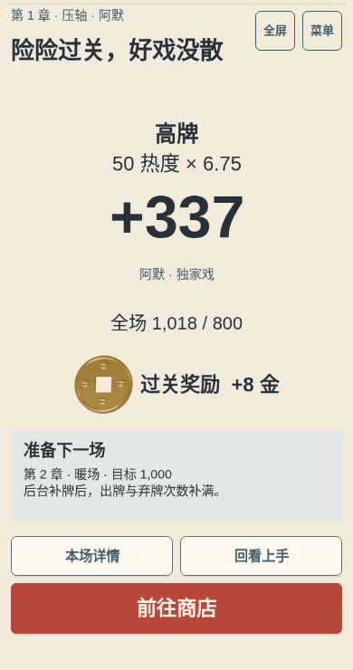

# P08：同一自然局至首个 Boss 的有界证据

本次在冻结源码 [`7b78777347dd854f5759870c7934b8c28279889e`](https://github.com/big-dimple/dachoupai/commit/7b78777347dd854f5759870c7934b8c28279889e) 上，从新局沿原生操作自然到达首个 Boss B01 结果。最终 **1018/800 过关，金币 10，seq 26、journal 25**；停在结果页，未进入第二章。此次提交只归档证据，不改运行代码、素材或 main，不宣布 P08 整体验收完成。

运行为 seed `p08-batch3-natural`、阿默 `amo`、普通模式 D0；390×740、DPR 1、Chromium 151.0.7922.173、无硬件 GPU 的软件 Canvas、普通动效、原生触控操作。速度仅从 1× 切至 2× 一次。使用 `e2e` 构建的既有 harness 引用读取状态，游戏入口、购买、选牌、整理、弃牌、出牌、工具和继续均走原生 UI；没有注入状态、牌、分数、金币或 RNG，没有改种子、跳关或强制获胜。

构建身份为 C03、revision `7b78777347dd854f5759870c7934b8c28279889e`、`modified=false`，时间 `2026-10-04T19:07:17.555Z`。`npm run build -- --mode e2e --outDir shots/p08-natural-run/build`（含 TypeScript 检查）通过。实际 bundle `assets/index-CN6hrgew.js` 为 1,970,712 字节，原始字节 SHA256 为 `b4bfd9a297cbfd06daefcef8ef91188085e9fa4cacfa9c2d83b8c25155c95d7f`。证据提交后的源码身份仍以此冻结 SHA 为准。

| 场次 | 实际出牌得分 | 最终进度 | 本场结束金币 |
| --- | --- | --- | --- |
| 第 1 章暖场，index 0 | 同花 692 | 692/400 | 7 |
| 第 1 章正场，index 1 | 两对 278、葫芦 1505 | 1783/600 | 10 |
| 第 1 章压轴 B01，index 2 | 高牌 344、337、337 | 1018/800 | 10 |

开局依次打开 b05、a12、d06 的真实购买详情并取消，取消前后完整存档及所有槽位相同；支付 6 金购买 b05 合唱班，余额 6→0。进入首场后观察 0/1/5 张选择；点数与花色整理均归还全部选牌，只有 `ReorderHand` 的顺序、seq、receipt 改变，其他完整 state 和 RNG 相同。候选示例先显示 10♠ ghost 而保留原来的五张选择，再明确换组，随后撤销回原五张；该过程完整存档和槽位不变。

首场两次正常弃牌后打出五张黑桃，同花 692 自然过关。首个后续商店自然出现 T10 加厚纸：支付 4 金（7→3），进场后原生选择 6♦、6♣ 并确认，seq 14 的 `UseConsumable` 消耗一件 T10，两张牌各获得热度纸 +20，随后实际计分来源出现。次场结束后自然购买 a06 独家戏，支付 8 金（10→2）。B01 的规则弹窗实际显示「弃牌耗 2 次」；第一手前一次正常弃牌由 3 次降至 1 次，再依次打出可见 A♦、K♥、Q♣。暂停检查点为 681/800、剩 2 次出牌和 1 次弃牌；获准继续后，同一浏览器、同一局仅出 Q♣，得 337，自然到达终局。

| 三处原生刷新恢复 | seq / 金币 | 刷新前实际位置 | 继续后 |
| --- | --- | --- | --- |
| 购买后 | 2 / 0 | shop，b05 已保存 | shop，相同库存与金币 |
| 正式出牌演出中 | 9 / 7 | game，10♠ 的实际 `impact`；同花 692 和过关奖励已原子保存 | intermission，未补播来源演出 |
| 已结算结果 | 9 / 7 | intermission，首场已过关 | intermission，奖励不重复 |

每处均比较**刷新前、刷新后标题页、原生继续后**的完整 checkpoint，以及 IndexedDB 的 meta/current/previous 全值，没有只挑分数或 RNG 字段。三组均完全相等；第二、第三处处于不同 UI 时点，但共享 seq 9，因为得分和奖励与该次出牌一起保存。完整三点数据见 [recoveries.json](recoveries.json)，本次没有第四次恢复或重做既有恢复。

终局最后一手 `command/26` 只增加一条命令和 receipt，金币由 2→10，`goldEarned=8`，`clearId=run/p08-batch3-natural/amo/clear/2`。自然首 Boss 补给仅一件 T16，instance 为 `run/p08-batch3-natural/amo/first-boss/supply`，`supplyRewardClaimed=true`。终局剩 1 次出牌、1 次弃牌；T16 未使用，未点「前往商店」。六手正式出牌的提交后与结算后完整 checkpoint/槽位都一致，终局截图前后也一致。首场后续商店金币仍为 7，次场后续商店仍为 10，恢复或转场没有多领奖励。

原有三张图按原始字节复制，仅补一张实际终局图；四张均已实际查看。

| 原图 | 实际时点与限制 |
| --- | --- |
| [01 购买恢复后的商店](01-shop-after-purchase-recovery.png) | seq 2，持有 b05、余额 0；入口动画的较早一帧，货架仍在入场，不能用作货架完整美术验收 |
| [02 首手真实来源 impact](02-first-play-actual-source.png) | `command/9/event/1` 的 10♠ 来源；屏上是正在变化的演出数值，领域真实最终分为 692 |
| [03 Boss 暂停检查点](03-Boss-paused-checkpoint.png) | 681/800，金币 2，剩 2 次出牌、1 次弃牌，游戏 ready |
| [04 首 Boss 终局](04-first-Boss-result.png) | 真实结果页：50 热度 × 6.75、+337、全场 1018/800、过关奖励 +8 金 |

可审计数据：

- [summary.json](summary.json)：构建身份、路径摘要、工具、终局、原始 PNG 哈希和验收范围。
- [initial-checkpoint.json](initial-checkpoint.json)、[final-checkpoint.json](final-checkpoint.json)：未改写的开局及终局完整 checkpoint，包括真实 seed、RNG、seq、receipts、journal、库存和 trace。
- [recoveries.json](recoveries.json)：三处恢复的完整存档和全部槽位，以及三点 UI 状态。
- [observations.json](observations.json)：实际步骤时序、只读与整理核验、提交/结算比较、已保存来源 trace、真实 postrender frame/phase 节点、暂停及终局完整数据。首手因刷新中断，仅有实际 impact 快照，未声称观察完整剩余演出；后续节点也不是录屏或 FPS 测量。
- [journal-verification.json](journal-verification.json)：终局后只读加载原源码的纯领域实现，对 25 条实际命令重放，79 个已观察快照逐 state 比较，最终完整 state/RNG 相同；251 个 checkpoint 对象通过原 `readCheckpoint`。重复最后命令只在领域逻辑中验证为 duplicate、无事件、完整 state/RNG 不变；原生连续双击不在此次范围。

观察期间没有未捕获页面异常；资源日志含 `/favicon.ico` 的 404。一次 Node 观察脚本错误把实际 `DiscardHand` 预期成 `Discard`，在已提交检查点停止；修正观察脚本后保持同一浏览器和局继续，产品代码与存档未改。初始观察脚本曾对首张图及 JS 的序列化 Buffer 计算指纹；此归档统一从原始字节重算，存档不受影响。

此证据只覆盖这一种子、角色、模式、视口和软件 Canvas。**硬件 GPU、真实 PC、OnePlus、听感、录屏/FPS、reduced-motion：NOT_RUN。** 未重跑本地完整测试冻结，证据 review 的 CI 状态另报；不将本局胜利或四张静帧扩大为 P08 整体、设备或视觉通过。
